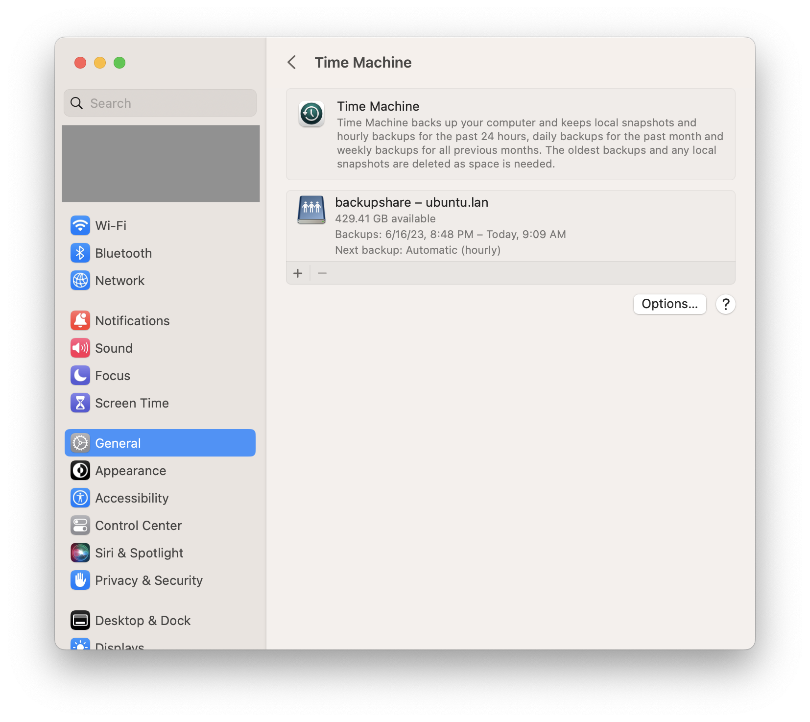
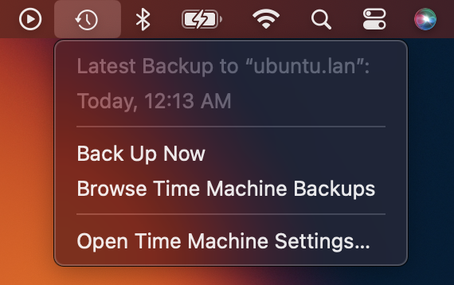
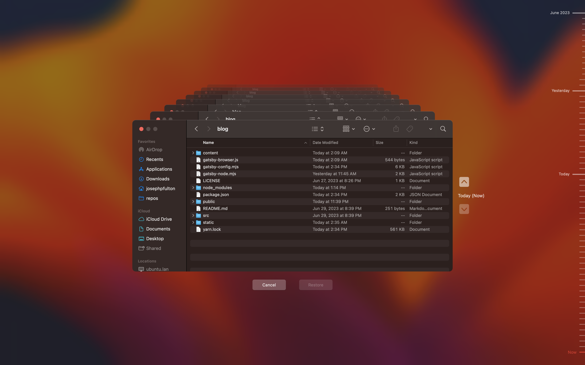

Apple hardware often outlives the lifespan of the operating system software that
runs it if taken care of. I had a ten year old Mac desktop based on Intel hardware
which was reaching the end of operating system support. As new feature for the
ecosystem started to come out, the usefulness of the system diminished so it
became time for it to have a new life: as a Linux machine.

The system specs were impressive for the era in which it was purchased:

- Intel i5-4570 (4 core) @ 3.600GHz
- NVIDIA GeForce GT 755M Mac Edit
- 16 GB RAM
- 1 TB Hard Drive

Great utility could still be derived from this system using a different operating
system so I installed a recent version of
[Ubuntu Linux](https://ubuntu.com/download/desktop) (Ubuntu 22.04.2 LTS x86_64).
The first order of business was to make it useful to rest of the current home
ecosystem.

While iPhones and iPads will backup to [iCloud](https://www.apple.com/icloud/),
macOS will not at the time of this writing. The backup technology
([Time Machine](https://support.apple.com/en-us/HT201250)) requires
either a NAS or another network storage system to backup accross a network.

Thankfully, one of the supported protocols is a
[SMB](https://learn.microsoft.com/en-us/windows/win32/fileio/microsoft-smb-protocol-and-cifs-protocol-overview)
share per the support
[article](https://support.apple.com/en-us/HT202784) on backup disks.

## Table of Contents

## Samba Installation and Configuration

Linux supports the SMB protocol through a service called
[Samba](https://www.samba.org/samba/what_is_samba.html). Its installation
on modern Linux distributions is straight forward.

### Samba Installation

Start by updating the apt registry:

```shell{outputLines: 2-10}
sudo apt update
Hit:1 http://us.archive.ubuntu.com/ubuntu jammy InRelease
Get:2 http://security.ubuntu.com/ubuntu jammy-security InRelease [110 kB]
Get:3 http://us.archive.ubuntu.com/ubuntu jammy-updates InRelease [119 kB]
...
Fetched 4,279 kB in 1s (3,882 kB/s)
Reading package lists... Done
Building dependency tree... Done
Reading state information... Done
26 packages can be upgraded. Run 'apt list --upgradable' to see them.
```

Then install the samba package:

```shell
sudo apt install samba
```

### Samba Configuration

The Samba configuration exists at `/etc/samba/smb.conf`.

```shell
sudo vim /etc/samba/smb.conf
```

The following section needs to be added to the `[global]` section of
the configuration file. It establishes the file system extensions
and protocol versions necessary to support macOS.

```sh:title=smb.conf {numberLines: true}
### Time Machine Compatibility ###
min protocol = SMB2
vfs objects = fruit streams_xattr
fruit:metadata = stream
fruit:model = MacSamba
fruit:posix_rename = yes
fruit:veto_appledouble = no
fruit:wipe_intentionally_left_blank_rfork = yes
fruit:delete_empty_adfiles = yes
server min protocol = SMB2
```

Add the following to the end of the file to create a dedicated
share for time machine backups:

```sh:title=smb.conf {numberLines: true}
[backupshare]
comment = Apple Backup Shared Folder by Samba Server on Ubuntu
path = /mnt/samba/AppleBackups
fruit:time machine = yes
force user = smbuser
force group = smbgroup
read only = no
browseable = yes
create mask = 0664
force create mode = 0664
directory mask = 0775
force directory mode = 0775
```

### WINS Support

By default, Samba relies upon [NetBIOS](https://en.wikipedia.org/wiki/NetBIOS_over_TCP/IP)
broadcasts within a subnet to declare availability of shares to a small group of
network nodes. This works well for most home networks. However, if your home network
involves multiple subnets or routed segments shares will not be visible to all clients.
NetBIOS broadcast are not route-able. To allow routed segments (e.g VPN clients) to
discover shares, use a [WINS](https://en.wikipedia.org/wiki/Windows_Internet_Name_Service)
configuration. Add the following lines to the `[global]` section of the `smb.conf`:

```sh:title=smb.conf {numberLines: true}
### WINS Support ###
wins support = yes
dns proxy = yes
```

### Complete Configuration

The complete example configuration file can be found
[here](https://github.com/jpfulton/example-linux-configs/blob/main/etc/samba/smb.conf).

## macOS Settings

In macOS, choose the Apple menu  > System Settings, click General in the sidebar,
then click Time Machine on the right. Once on the settings pane, click the add button
to open a dialog to select the network share configured in Samba.



After setting up the disk, you may use the time machine icon at the top of the
screen to observe the progress of the backup, directly access the settings or
browse the backup contents.



Browsing the backup offers a powerful feature where through a Finder
window the user may observe folders and files across the lifetime of the
backup set.


