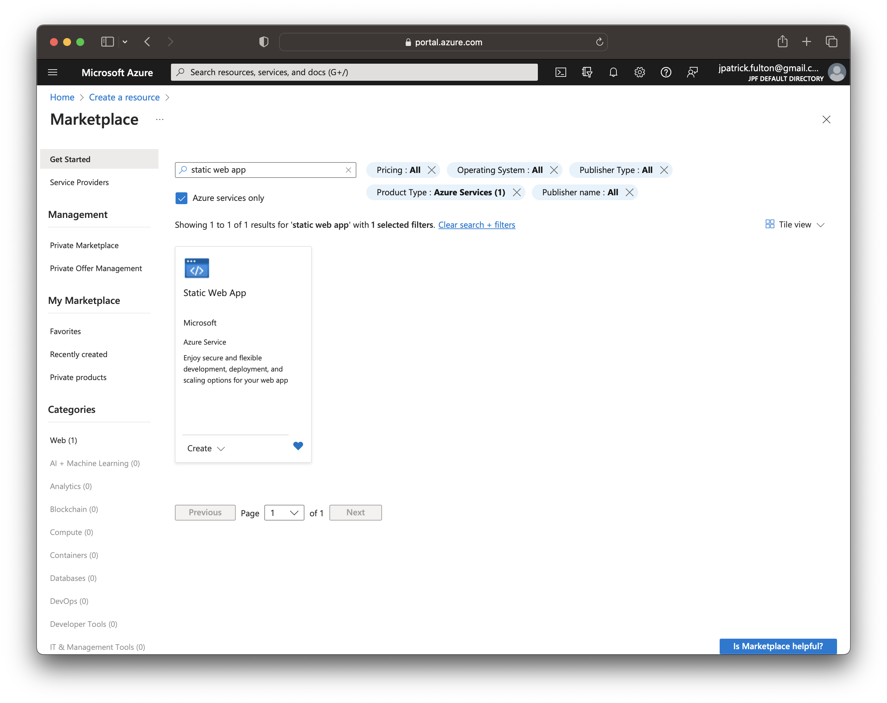
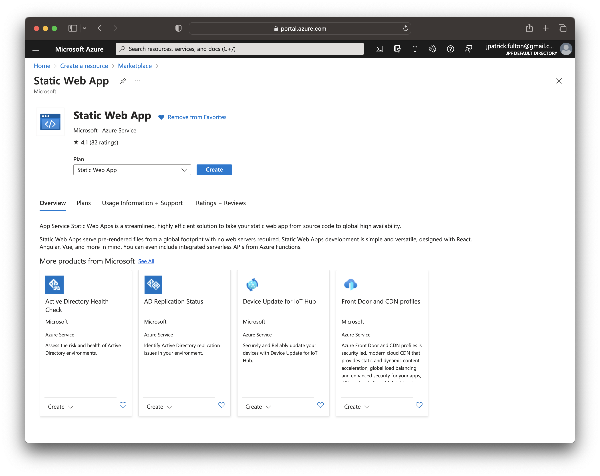
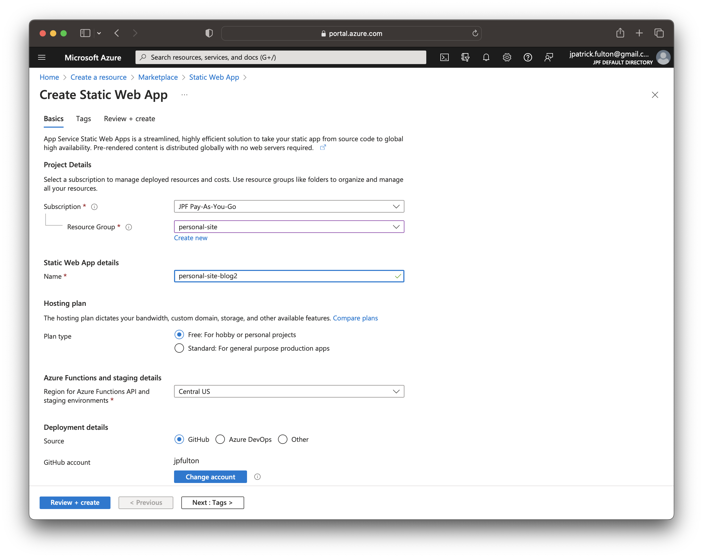
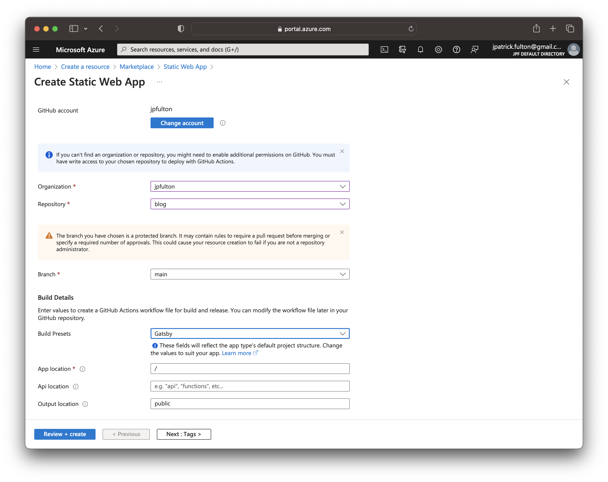
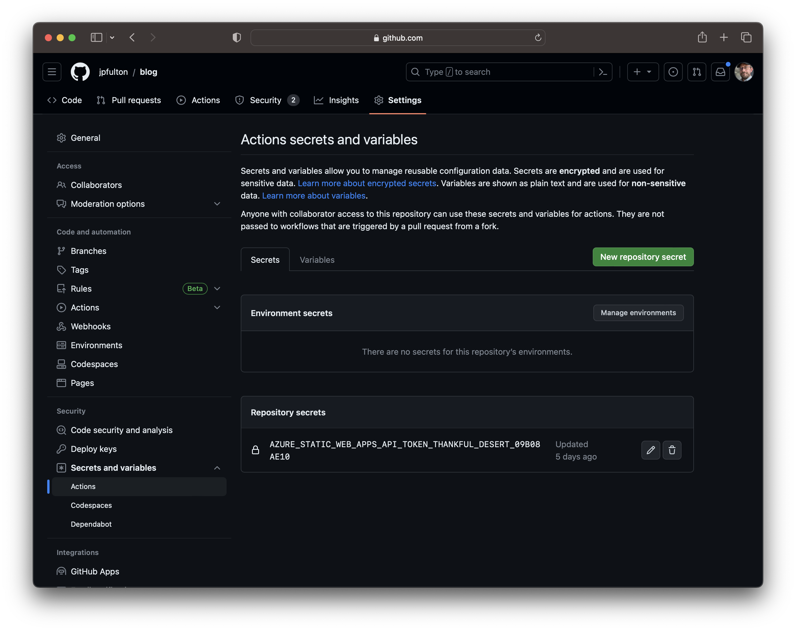
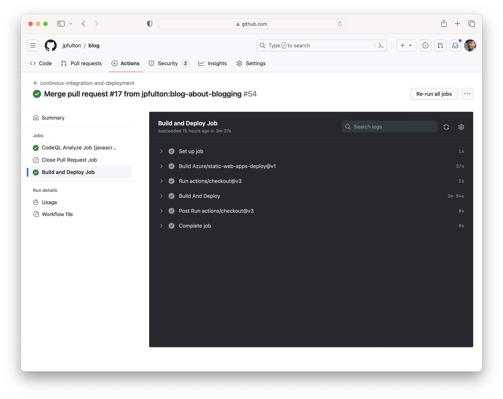

Publishing a [Gatsby](https://www.gatsbyjs.com/) website to
[Azure Static Web Apps](https://azure.microsoft.com/en-us/products/app-service/static)
using
[GitHub Actions](https://github.com/features/actions)
is fairly straight forward. The Azure product team made things easy on us.

The evolving **GitHub repository** storing this blog and its implementation can be
found [here](https://github.com/jpfulton/blog).

## Table of Contents

## Prerequisites

This article makes a few assumptions as prerequisites to following this guide.

- An [Azure](https://azure.microsoft.com/en-us) account and subscription are
  already in place
- A [GitHub](https://github.com/) account already exists
- A repository exists with a [Gatsby](https://www.gatsbyjs.com/) website that
  builds and is ready to deploy is already in place

## Azure Configuration

Login into the [Azure Portal](https://portal.azure.com) and select "Create a Resource"
from the Home screen. Search for "static web app" on the Marketplace screen and select
the Azure service as shown below.



Click the "Create" button to begin the resource creation wizard.



Complete the elements shown on the "Basics" tab by selecting values appropriate
to your deployement.

- Choose an existing subscription
- Either select an existing resource group or create a new one to host the resource
- Choose a name for the new resource
- Select a plan type (this can easily be changes later)
- Choose a region



Scroll down to configure deployment options. Use the GitHub option in the
"Deployment Details" section.

- Use OAuth to log into your GitHub account
- Select an organization to which you belong
- Choose the repository containing your Gatsby website source code
- Under "Build Details", select "Gatsby" from the "Build Presets" dropdown
  to prepopulate the remaining options



Click the "Review + create" button to review and validate the selections
prior to running the deployment. Once your review is complete, launch the deployment
and navigate to the newly created resource.

## GitHub Configuration

The steps above will make a few changes to your project repository.

Firstly, a new YAML workflow file will be created under your `.github` folder at
the root of your repository. This new workflow will drive a GitHub Actions flow
to build and deploy your website to Azure.

The generated workflow has two jobs configured within that support builds
and deployments for both your production and preview environments. The first
job (`build_and_deploy_job`) is responsible for building and deployemnt. The
second (`close_pull_request_job`) is responsible for cleaning up preview environments
upon the closure of PRs. Merges or pushes into the default branch trigger deployments
to the production environment. Pull requests and additions to pull requests
trigger deployments to a preview environment.

I rename this [workflow file](https://github.com/jpfulton/blog/blob/main/.github/workflows/cicd.yml)
and make a few manual edits within my repositories. For example, giving the build
and deploy job `pull-requests: write` permission allows the job to make comments
on pull requests that include the URLs of newly deployed preview environments
which is a useful feature.

```yaml{8,17}{numberLines: true}
build_and_deploy_job:
    if: github.event_name == 'push' || (github.event_name == 'pull_request' && github.event.action != 'closed')
    runs-on: ubuntu-latest
    name: Build and Deploy Job
    needs: analyze
    permissions:
        contents: read # for actions/checkout to fetch code
        pull-requests: write # for Azure/static-web-apps-deploy to comment on PRs
    steps:
        - uses: actions/checkout@v3
        with:
            submodules: true
        - name: Build And Deploy
        id: builddeploy
        uses: Azure/static-web-apps-deploy@v1
        with:
            azure_static_web_apps_api_token: ${{ secrets.AZURE_STATIC_WEB_APPS_API_TOKEN_THANKFUL_DESERT_09B08AE10 }}
            repo_token: ${{ secrets.GITHUB_TOKEN }} # Used for Github integrations (i.e. PR comments)
            action: "upload"
            ###### Repository/Build Configurations - These values can be configured to match your app requirements. ######
            # For more information regarding Static Web App workflow configurations, please visit: https://aka.ms/swaworkflowconfig
            app_location: "/" # App source code path
            api_location: "" # Api source code path - optional
            output_location: "public" # Built app content directory - optional
            ###### End of Repository/Build Configurations ######
```

The second change made by the Azure deployment to your GitHub repository
is the addition of a repository secret which is referenced by the
deployment workflow. The secret contains the deployment token from your
Azure Static Web App. This token allows for secure deployment into Azure.
Should you ever need to change it through the Azure portal. You will need
to alter its value in GitHub as well.



## Project package.json Configuration

The [GitHub Action](https://github.com/Azure/static-web-apps-deploy) that was
utilitzed in the workflow file placed in the `.github` folder uses
[Microsoft Oryx](https://github.com/microsoft/Oryx) to build the repository.
At the time of this writing, [NodeJS](https://nodejs.org/en) v18+ was
not natively installed on its image. While Node v16 appears to be pre-installed,
Gatsby v5+ requires Node v18 or better. The Oryx system is equipped to
update itself with the dependencies that it requires if metadata is provided
to it that allows it to identify them. Modifying `package.json` provides
the information that the build engine will need to correctly run the later
versions of Gatsby.

Check your [NodeJS](https://nodejs.org/en) version with command below:

```shell{outputLines:2}
node -v
v18.16.0
```

Add or modify the following sections in `package.json` to provide Oryx
with the information it needs to recognize the node version and complete
the build process sucessfully.

```javascript:title=package.json {2}{numberLines:true}
"engines": {
    "node": ">=18.16.0"
},
```

Once these changes are in place, deployments should run smoothly.



## Conclusion

With just a handful of tweaks, a modern Gatsby website can be deployed
to Azure Static Web Apps in a matter of minutes. Builds and deployments
through GitHub Actions are quick and hosting through Azure can be either
low cost or free.
