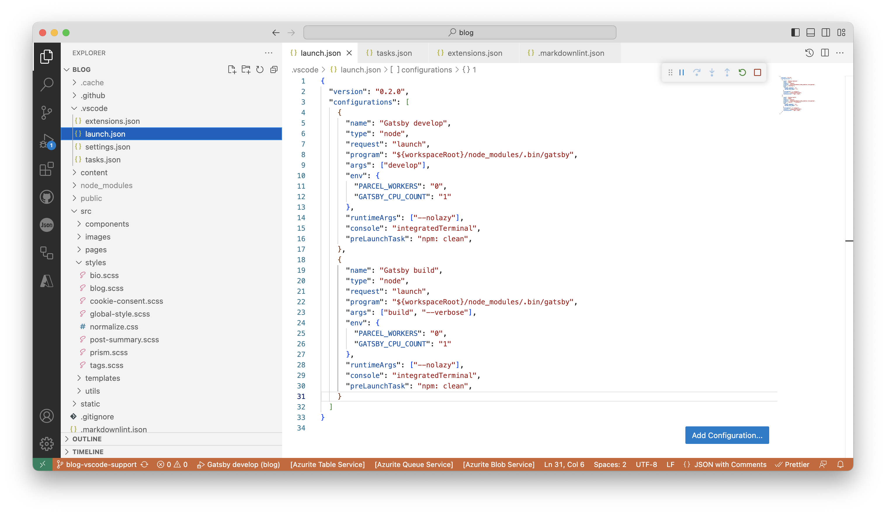
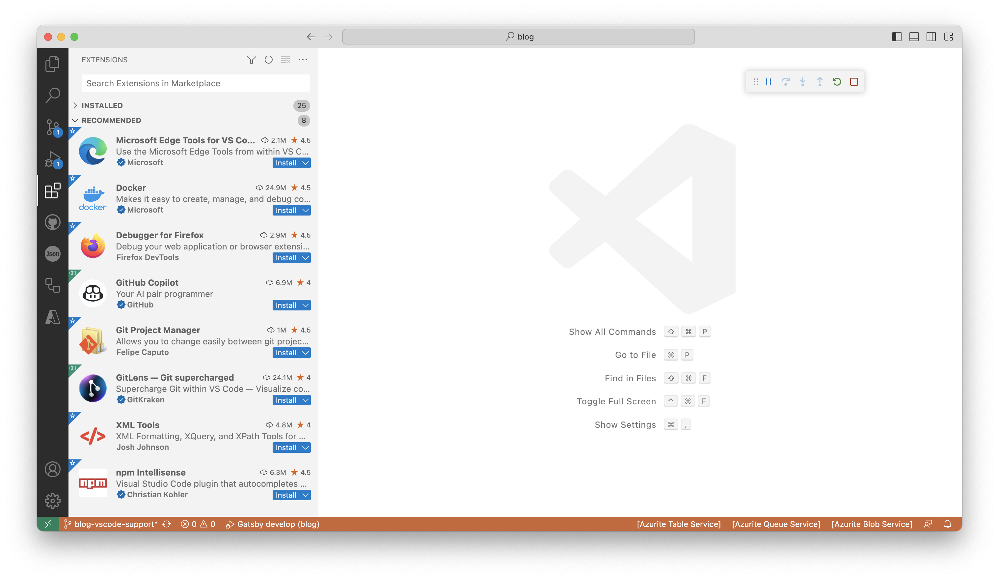
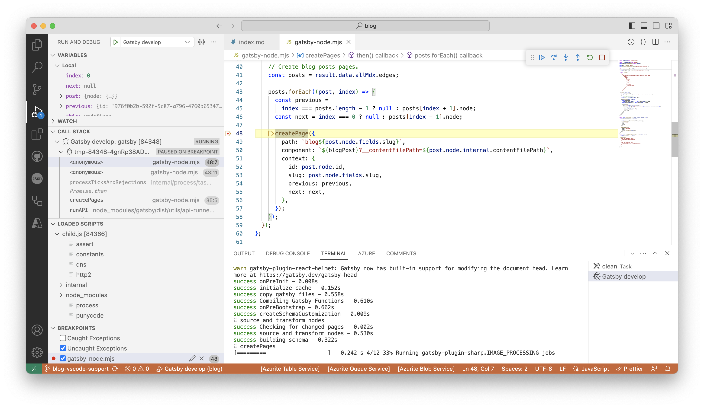

Despite being a long-term and professional user of the full version of
[Visual Studio](https://visualstudio.microsoft.com/),
[Visual Studio Code](https://code.visualstudio.com/) quickly became my IDE
of choice. It is light weight, cross platform and has an exceptional
[extension ecosystem](https://marketplace.visualstudio.com/VSCode).

> Visual Studio Code, also commonly referred to as VS Code, is a source-code
> editor made by Microsoft with the Electron Framework, for Windows, Linux and macOS.
> Features include support for debugging, syntax highlighting, intelligent code
> completion, snippets, code refactoring, and embedded Git.
> _([Wikipedia](https://en.wikipedia.org/wiki/Visual_Studio_Code))_

When I started working on this blog and implemented it in [Gatsby](https://www.gatsbyjs.com/),
it was important to develop good support in the project for VS Code and to
be able to effectively debug issues as they arose and edit content using that tool.



The evolving **GitHub repository** storing this blog and its implementation can be
found [here](https://github.com/jpfulton/blog).

## Table of Contents

## The .vscode Folder

The `.vscode` directory is generally found at the root of a
[mulit-repo pattern](https://kinsta.com/blog/monorepo-vs-multi-repo/). In a
[mono-repo pattern](https://en.wikipedia.org/wiki/Monorepo), it can be found
or extended in the root folder for each sub-project. Details on the files
commonly found there are documented in this
[article](https://code.visualstudio.com/docs/getstarted/settings).

In the **GitHub repository** storing this blog implementation, the directory can
be found [here](https://github.com/jpfulton/blog/tree/main/.vscode).

### The launch.json File

The `launch.json` file controls the Run and
[Debug](https://code.visualstudio.com/docs/editor/debugging) functions in VS Code.

Gatsby offers a [guide](https://www.gatsbyjs.com/docs/debugging-the-build-process/)
to debugging in VS Code. I adapted its suggestions with some modification here.
For example, I utilize a prelaunch task to ensure a clean prior to running either
a build or develop command.

There are some notable elements in this file. Firstly, through environment
variables, the normal multithreading of Gatsby is limited to make debugging
easier. Secondly, `--nolazy` is passed to the Node runtime ease breakpoint
setting per the VS Code
[documentation](https://code.visualstudio.com/docs/nodejs/nodejs-debugging).

> For performance reasons Node.js parses the functions inside JavaScript files
> lazily on first access. As a consequence, breakpoints don't work in source code
> areas that haven't been seen (parsed) by Node.js.

```json:title=launch.json {16,30}{numberLines: true}
{
  "version": "0.2.0",
  "configurations": [
    {
      "name": "Gatsby develop",
      "type": "node",
      "request": "launch",
      "program": "${workspaceRoot}/node_modules/.bin/gatsby",
      "args": ["develop"],
      "env": {
        "PARCEL_WORKERS": "0",
        "GATSBY_CPU_COUNT": "1"
      },
      "runtimeArgs": ["--nolazy"],
      "console": "integratedTerminal",
      "preLaunchTask": "npm: clean",
    },
    {
      "name": "Gatsby build",
      "type": "node",
      "request": "launch",
      "program": "${workspaceRoot}/node_modules/.bin/gatsby",
      "args": ["build", "--verbose"],
      "env": {
        "PARCEL_WORKERS": "0",
        "GATSBY_CPU_COUNT": "1"
      },
      "runtimeArgs": ["--nolazy"],
      "console": "integratedTerminal",
      "preLaunchTask": "npm: clean",
    }
  ]
}
```

### The tasks.json File

The `tasks.json` [file](https://code.visualstudio.com/docs/editor/tasks) controls
integration with external tools.

> These tools are mostly run from the command line and automate jobs inside
> and outside the inner software development loop (edit, compile, test, and debug).
> Given their importance in the development life cycle, it is helpful to be able
> to run tools and analyze their results from within VS Code.

Here I integrated the clean script from `package.json` as a task so that it could
be used as a prelaunch task in `launch.json` as highlighted above.

```json:title=tasks.json {numberLines: true}
{
    "version": "2.0.0",
    "tasks": [
      {
        "type": "npm",
        "script": "clean",
        "isBackground": true,
        "problemMatcher": {
          "owner": "typescript",
          "pattern": "$tsc",
          "background": {
            "activeOnStart": true,
            "beginsPattern": {
              "regexp": "(.*?)"
            },
            "endsPattern": {
              "regexp": "Successfully deleted directories"
            }
          }
        }
      },
    ],
}
```

### The settings.json File

The `settings.json` file defines project level
[settings](https://code.visualstudio.com/docs/getstarted/settings) that
apply specifically to the open workspace.

Here I have specified `prettier` as the default code formatter and provided
several editor settings that apply to it.

```json:title=settings.json {numberLines: true}
{
  "editor.tabSize": 4,
  "editor.formatOnSave": true,
  "editor.codeActionsOnSave": [
    "source.fixAll",
    "source.organizeImports",
    "source.sortMembers"
  ],
  "editor.defaultFormatter": "esbenp.prettier-vscode"
}
```

## Recommended Extensions in Use

The `extensions.json` file includes a series of recommended VS Code extensions
for the project.

- [Markdownlint](https://marketplace.visualstudio.com/items?itemName=DavidAnson.vscode-markdownlint)
- [Prettier - Code Formatter](https://marketplace.visualstudio.com/items?itemName=esbenp.prettier-vscode)
- [GitHub Actions](https://marketplace.visualstudio.com/items?itemName=GitHub.vscode-github-actions)
- [GitHub Pull Requests and Issues](https://marketplace.visualstudio.com/items?itemName=github.vscode-pull-request-github)
- [JSON](https://marketplace.visualstudio.com/items?itemName=ZainChen.json)

### The extensions.json File

To make things super easy, the `extensions.json` file in the `.vscode` directory
includes the keys for each extension and integrates with the IDE to make the suggestions
upon opening the repository.

```json:title=extensions.json {numberLines: true}
{
    "recommendations": [
        "davidanson.vscode-markdownlint",
        "esbenp.prettier-vscode",
        "github.vscode-github-actions",
        "github.vscode-pull-request-github",
        "zainchen.json",
    ]
}
```



### Using the VS Code Markdownlint Extension

When building this implementation, I went to a great deal of trouble to use the
[gatsby-plugin-mdx plugin](https://github.com/gatsbyjs/gatsby/tree/master/packages/gatsby-plugin-mdx)
to make authoring content in markdown with extensions for
[React](https://react.dev/) components
a first class citizen in the project. My extension of choice for markdown editing
and linting in VS Code is `davidanson.vscode-markdownlint`. However, I was unable
to find settings for it that would extend its use to `.mdx` files. Technically, the
markdown that powers this blog is MDX though leaving the files with a `.md` file
extension allows that VS Code plugin to do its magic. As a result, I simply modified
the options of the `gatsby-plugin-mdx` plugin to look for `.md` files as well.

```javascript:title=gatsby-config.js {4}{numberLines: true}
{
  resolve: `gatsby-plugin-mdx`,
  options: {
    extensions: [`.mdx`, `.md`],
    ...
  },
},
```

Traditional markdown files disallow inline HTML tags and the linter has a rule
to enforce this: `MD033`. MDX file, on the other hand, needs what looks like
inline HTML tags to allow React components to be included. As a result, I
created a `.markdownlint.json` file at the root of the project to configure
the linter extension to ignore that rule.

```json:title=.markdownlint.json {numberLines: true}
{
  "MD033": false
}
```

### Using the VS Code Prettier Extension

Per the `settings.json` file, the Prettier extension is set as the default code
formatter for the project. On file save, it is configured to work its magic:
correcting quality problems, reformatting tabs, _organizing imports_ and sorting
members. In combination with the `format` script in the `package.json` file,
this makes things fairly easy to maintain nice code quality for the project.

I am a big fan of the **import organization** feature. However, use _caution_
with it on certain files. For example, in the `gatsby-browser.js`
[file](https://www.gatsbyjs.com/docs/reference/config-files/gatsby-browser/),
unlike most sets of import statements, **order matters here**. If you are not paying
attention, the Prettier plugin can reorder your
[CSS and SASS](https://www.gatsbyjs.com/docs/how-to/styling/built-in-css/)
imports in way creates unexpected styling behaviors.

**Pro Tip:** Prettier will alphabetize and organize import statements **within**
groups. The behavior can be controlled by separating groups of import statements
with either new lines or comments.

```javascript:title=gatsby-browser.js {numberLines: true}
// normalize CSS across browsers
import "./src/styles/normalize.css";

// global styles
import "./src/styles/global-style.scss";

// prismjs highlighting theme for code blocks
import "prismjs/themes/prism-coy.css";
// prismjs highlighting plugins for code blocks
import "prismjs/plugins/command-line/prism-command-line.css";
import "prismjs/plugins/line-numbers/prism-line-numbers.css";

// custom component and page level styles
import "./src/styles/bio.scss";
import "./src/styles/blog.scss";
import "./src/styles/cookie-consent.scss";
import "./src/styles/post-summary.scss";
import "./src/styles/prism.scss";
import "./src/styles/tags.scss";
```

## Debugging Gatsby with VS Code

With the VS Code support files in place, **most** elements of the Gatsby build
process and develop mode runs can be debugged with standard features in the IDE.
From the `Run and Debug` tab, Gatsby can be launched in either develop or build
mode and breakpoints set. This works for nearly all cases.



## Outstanding Debugging Issues

The main debugging issue that I have uncovered working with this setup on
the project is the inability to set breakpoints in templates loaded by
the createPages method in the
[Gatsby Node API](https://www.gatsbyjs.com/docs/reference/config-files/gatsby-node/#createPages)
using the
[createPage action](https://www.gatsbyjs.com/docs/reference/config-files/actions/#createPage).
These templates are loaded dynamically at runtime from a path. As such, the debugger
has no access to them and debugging must be performed from the Gatsby error messages.
I have yet to find a workaround which would very much come in handy when building new
features.

```javascript:title=gatsby-node.mjs {4,13}{numberLines:true}
export const createPages = ({ graphql, actions, reporter }) => {
  const { createPage } = actions;

  const blogPost = path.resolve(`./src/templates/blog-post.js`);
  ...
  posts.forEach((post, index) => {
      const previous =
        index === posts.length - 1 ? null : posts[index + 1].node;
      const next = index === 0 ? null : posts[index - 1].node;

      createPage({
        path: `blog${post.node.fields.slug}`,
        component: `${blogPost}?__contentFilePath=${post.node.internal.contentFilePath}`,
        context: {
          id: post.node.id,
          slug: post.node.fields.slug,
          previous: previous,
          next: next,
        },
      });
    });
  ...
```
