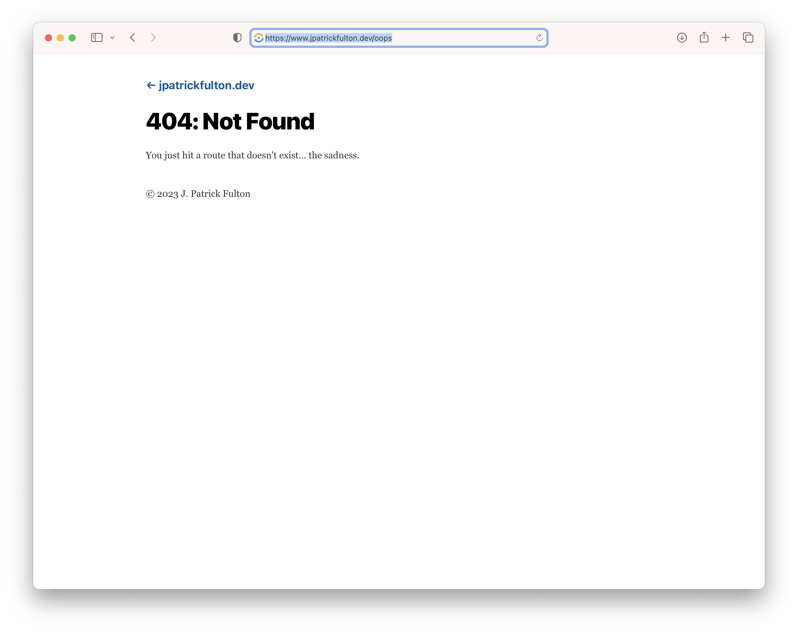

[Azure Static Web App](https://azure.microsoft.com/en-us/products/app-service/static)
containers are configured with a JSON file at the root of their deployment called
`staticwebapp.config.json`. Most [Gatsby](https://www.gatsbyjs.com/) starters
already come equipped with a custom 404 page for use internally when a bad route
is requested on the client side. This article focuses on reusing that page's
output for server-side 404 responses in an Azure Static Web App.

The evolving **GitHub repository** storing this blog and its implementation can be
found [here](https://github.com/jpfulton/blog).

## Table of Contents

## The Gatsby 404.js File

Found in `/src/pages/404.js`, this Gatsby page renders a 404 page utilized
by the framework on the client side when a bad route has been requested. Its
output is rendered to `/404/index.html` in the `public` folder by a production
site build. It can easily be reused for server-side 404 responses to create
a clean and consistent user experience.

```javascript:title=404.js {numberLines: true}
import * as React from "react";
import { graphql } from "gatsby";

import Layout from "../components/layout";
import Seo from "../components/seo";

const NotFoundPage = ({ data, location }) => {
  const siteTitle = data.site.siteMetadata.title;

  return (
    <Layout location={location} title={siteTitle}>
      <h1>404: Not Found</h1>
      <p>You just hit a route that doesn&#39;t exist... the sadness.</p>
    </Layout>
  );
};

export const Head = () => <Seo title="404: Not Found" />;

export default NotFoundPage;

export const pageQuery = graphql`
  query {
    site {
      siteMetadata {
        title
      }
    }
  }
`;
```

## The staticwebapp.config.json File

An Azure Static Web App container may be configured by a `staticwebapp.config.json`
file placed at the root of the client application deployment. In a Gatsby site,
placing this file in the `/static/` folder will result in that file being placed
at the root of the output in a production build where it will be picked up
correctly by Azure upon deployment.

The [configuration file](https://learn.microsoft.com/en-us/azure/static-web-apps/configuration)
can be used to control a wide variety of settings for the container including:

- Routing
- Authentication
- Authorization
- Fallback rules
- [HTTP response overrides](https://learn.microsoft.com/en-us/azure/static-web-apps/configuration#response-overrides)
- Global HTTP header definitions
- Custom MIME types
- Networking

In the version of the file below, Azure is configured to use `responseOverrides`
to serve our custom 404 page output instead of the default Azure 404 page.

```json:title=staticwebapp.config.json {numberLines:true}
{
  "responseOverrides": {
    "404": {
      "rewrite": "/404/index.html",
      "statusCode": 404
    }
  }
}
```


