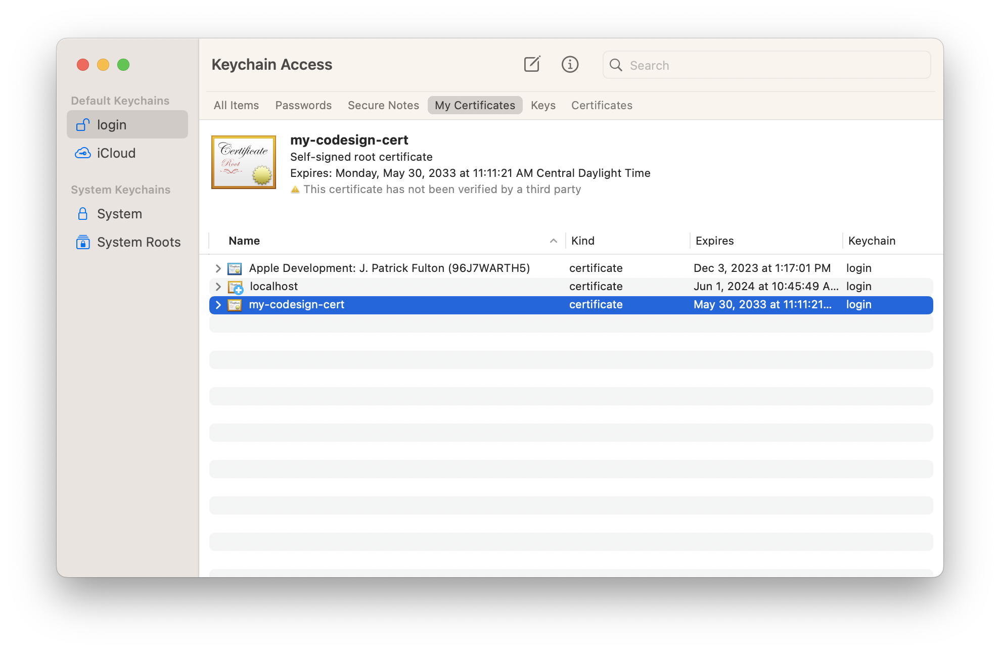
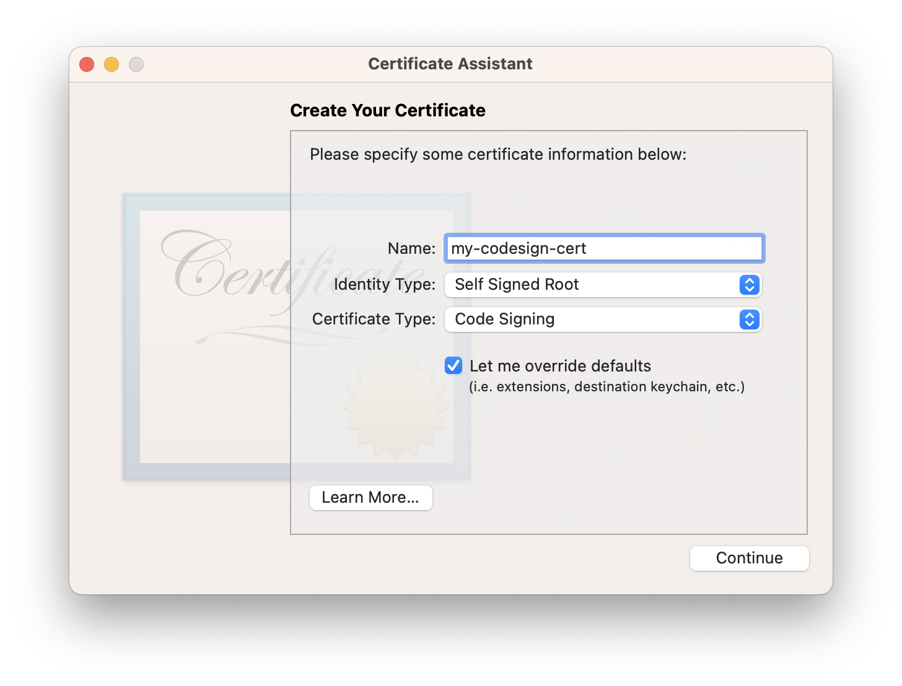
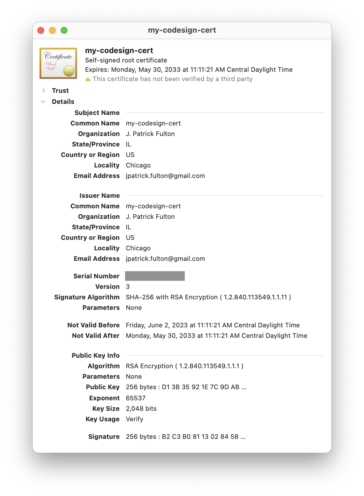

Quite painfully, the VS Code `ms-dotnettools.csharp`
[extension](https://marketplace.visualstudio.com/items?itemName=ms-dotnettools.csharp)
debugger binaries do not work out-of-the-box on modern macOS
[versions](https://support.apple.com/en-us/HT201260) (v12+). This article outlines
the steps that are necessary to get those debugger binaries working macOS Monterey
and beyond.

> I revisit this thread more frequently than I visit my in-laws.
> The resigning works, but it's just a pain.
> **([superman-lopez](https://github.com/dotnet/vscode-csharp/issues/4903#issuecomment-1554267307))**

The **unresolved**
[issue](https://github.com/dotnet/vscode-csharp/issues/4903) is documented on GitHub
and the
[solution](https://github.com/dotnet/vscode-csharp/issues/4903#issuecomment-993015843)
can be found there.

## Table of Contents

## Generate a Code Signing Certificate

In a **one-time step**, a new local self-signed certificate needs to be created
for the purpose of code signing the debugger binaries used by VS Code. This
certificate may be used again when the binaries are changed by to new versions
when the VS Code extension updates while the steps below must be **repeated**
for each extension update.

These steps were pulled from this
[Stack Overflow Answer](https://stackoverflow.com/questions/58356844/what-are-the-ways-or-technologies-to-sign-an-executable-application-file-in-mac/58363510#58363510).

### Open Keychain Access

In a terminal, run `open -a "Keychain Access"` to open the Keychain Access utility.



### Run the Certificate Assistant

From the **Keychain Access** menu, select Certificate Assistant > Create a Certificate
to open the assistant dialog.



### Generate a Self-Signed Certificate for Code Signing

Follow the steps in the assistant with the following steps:

1. Enter the Name (for example `my-codesign-cert`)
2. Identity Type > Self Signed Root
3. Certificate Type > Code Signing
4. Check **"Let me override defaults"** & click Continue.
5. Enter a unique Serial Number.
6. Enter a Validity Period (days), like `3560` & click Continue.
7. Fill in your personal information & click Continue.
8. Accept defaults for the rest of the dialog boxes.



## Re-sign the VS Code C# Debugger Binaries

The `ms-dotnettools.csharp` VS Code extension packages two binaries used in the
debugging process: `vsdbg` and `vsdbg-ui`. These binaries need to signed with
the certificate generated above. The first step is to identify the directory
where these binaries are currently located. **This directory changes between
installed versions of the extension and these steps need to be run
_every time_ the extension is updated by VS Code.**

Run the following commands to find the current location of these files:

```shell{outputLines:3}
cd ~/.vscode/extensions/
cd ls | grep ms-dotnettools.csharp
ms-dotnettools.csharp-1.26.0-darwin-x64
cd ms-dotnettools.csharp-1.26.0-darwin-x64/.debugger/x86_64/
```

In my case and at the time of this writing, the full path to the directory is
`/Users/josephpfulton/.vscode/extensions/ms-dotnettools.csharp-1.26.0-darwin-x64/.debugger/x86_64`.

Run the following command to remove the existing signature from that binaries:

`codesign --remove-signature vsdbg-ui && codesign --remove-signature vsdbg`

Next, run this command to sign the binaries with the self-signed certificate:

`codesign -s my-codesign-cert vsdbg-ui && codesign -s my-codesign-cert vsdbg`

Using VS Code, the debugger should now remain attached to C# processes and
correctly hit breakpoints set there.
