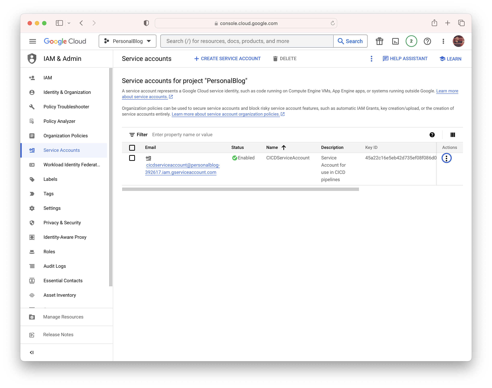
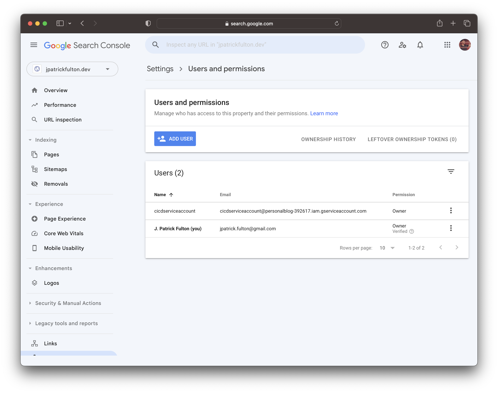
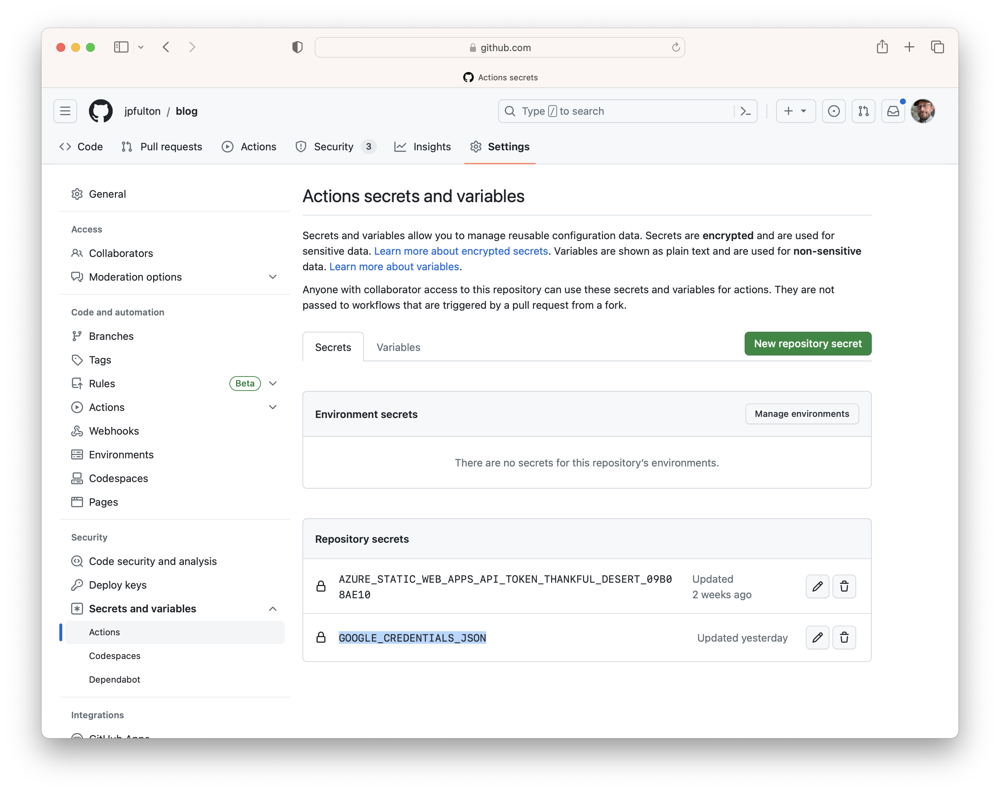

In the <Link to="/blog/2023-07-12-bing-and-indexnow/">previous post</Link>,
I discussed the challenges and delays associated with waiting for crawlers to
discover updated content and how to solve that issue for
[Microsoft Bing](https://www.bing.com) using
[IndexNow](https://www.indexnow.org/).

In this article, I discuss making live updates to [Google Search](https://www.google.com/)
via the
[Indexing API](https://developers.google.com/search/apis/indexing-api/v3/quickstart)
through
[GitHub Actions](https://github.com/features/actions)
using a shell script to update the search engine upon each deployment of the site.

The evolving **GitHub repository** storing this blog and its implementation can be
found [here](https://github.com/jpfulton/blog).

## Table of Contents

## Prerequisites for the Google Indexing API

Prior to using the Google Indexing API, a number of steps need to be
performed to enable authorization to the API and establish ownership for
the site you are submitting URLs on behalf of. Google provides a useful
[guide](https://developers.google.com/search/apis/indexing-api/v3/prereqs)
to these steps which was slightly out of date at the time of this writing.

### Establishing Site Ownership in the Google Search Console

Before starting, you will need to establish ownership of your site
through the
[Google Search Console](https://search.google.com/search-console/).
A number of mechanisms for this step are possible. As a user of
[Google Domains](https://domains.google/), I was able to add a property and establish
ownership of my site through the use of an affiliated product.

### Creating a Google Cloud Project

The first step in establishing access to the Indexing API is to create a project
in the [Google Cloud Console](https://console.cloud.google.com/start/api?id=indexing.googleapis.com&credential=client_key).
Once a project has been created, you may create a service account.

### Creating a Service Account with a JSON Key

On the [Service Accounts page](https://console.cloud.google.com/iam-admin/serviceaccounts),
create a new service account per the
[guide](https://developers.google.com/search/apis/indexing-api/v3/prereqs).



Once the service account has been created, select the highlighted menu beside
the account and
choose **Manage Keys**. On the next screen, choose **Add Key** and select the
**JSON** option. The key file will be downloaded. Store this file _securely_
as it contains a private key. You will need the contents of the file in later
steps when running the `easyindex-cli` utility and when creating a GitHub
repository secret.

### Adding the Service Account as a Site Owner

Copy the email address of the service account you just created. It will be in
the format of `my-service-account@project-name.google.com.iam.gserviceaccount.com`.
Navigate to the
[verification portal](https://www.google.com/webmasters/verification/home) and
select the property for which you have already verified ownership.



Select **Add User** and enter the email of the service account. Select **Owner**
under the permissions drop down and complete the dialog. The API will now be ready to
use in the following steps.

## The easyindex-cli Tool

Authored in [Go](https://go.dev/)
by [Yusuke Komatsu](https://github.com/usk81), the `easyindex-cli` utility
provides a command line interface for interacting with the Google Indexing API.
The [easyindex-cli](https://github.com/usk81/easyindex-cli/)
project is a command line wrapper around a
[library](https://github.com/usk81/easyindex/) written by the same author.

The utility accepts a CSV file composed of URLs to pass to the API. Additionally,
it performs a
[validation step](https://github.com/usk81/easyindex/blob/main/google/publish.go#L135)
to ensure the URLs are indexable. The library accesses each supplied URL to ensure
it returns an HTTP `200` response. Responses in the `300` range, which indicate a
redirect, are omitted from submission.

Both the command line utility and the supporting library are available on
GitHub under the [MIT license](https://opensource.org/license/mit/).

## The GitHub Actions Workflow

A few steps are necessary to modify the GitHub workflow and prepare
the repository for a workflow step that uses `easyindex-cli` to call
the Google Indexing API with URLs from the updated and recently released
site.

### Save the JSON Key as a Repository Secret

Navigate to your GitHub repository, and select
**Settings** > **Secrets and Variables** > **Actions** > **New Repository Secret**.
On the next screen create a new secret with the name `GOOGLE_CREDENTIALS_JSON`
and paste in the contents of your service account JSON key from the steps
above which you stored in a _secure_ place.



### Add the easyindex.sh Shell Script

The script below performs a series of steps on the GitHub Actions runner:

- Downloads the `easyindex-cli` binary to the runner via `curl`
- Builds an input CSV file containing site URLs
- Executes the `easyindex-cli` to submit those URLs to the Google Indexing API

In this implementation, it is stored in the `/.github/scripts/` folder.

Without arguments passed to the script, the Linux native binary will be downloaded.
The `easyindex-cli` tool is compiled for several platforms in each
[release](https://github.com/usk81/easyindex-cli/releases)
by its
[release workflow](https://github.com/usk81/easyindex-cli/blob/main/.github/workflows/release.yml)
which leverages the `goreleaser/goreleaser-action` Github Action.
As a native macOS user on an Intel CPU, I added a section of the script
that allows a flag to be passed to cause the script to download the macOS
native version of the binary for local testing purposes: `./easyindex.sh -o macos`.
On the GitHub Actions runner, this flag is omitted and the script defaults to
the Linux binary.

The URL structure of a generated [Gatsby](https://www.gatsbyjs.com/) site can be
derived from the structure of
the code that builds it. Therefore, a script that uses the structure of
the repository as its source material can be created that builds the URLs
of the pages that were generated is easy to create. The `easyindex-cli` tool
accepts a CSV file as input so creating
it in a shell script is possible with a series of `echo` commands directed
to a local working file. Once the temporary working file containing the URLs
is created, it is passed to the `easyindex-cli` utility.

```sh:title=easyindex.sh {numberLines: true}{clipboardButton: true}
#!/usr/bin/env bash

# Configurable variables used in IndexNow call and URL construction
HOST="www.jpatrickfulton.dev";
BASE_URL="https://${HOST}";
EASYINDEX_CLI_VERSION="1.0.6";

BLOG_DIR=../../../content/blog/; # Location of /content/blog/ folder relative to tmp working dir

WORKING_DIR=$( pwd; );
TMP_DIR=$WORKING_DIR"/tmp";

LOCAL_CREDENTIALS_FILE=../credentials.json;
CREDENTIALS_FILE=credentials.json;
URL_FILE=urls.csv;

# Look for a -o <value> flag to override the operating system
# selection from linux to macos
while getopts o: flag
do
  case "${flag}" in
    o) OPERATING_SYSTEM=${OPTARG};;
  esac
done

if [[ $OPERATING_SYSTEM == "macos" ]]
  then
    EASYINDEX_CLI_OS="darwin_amd64"; # Assumes a mac with an Intel CPU
  else
    # Use linux as a default OS
    OPERATING_SYSTEM="linux";
    EASYINDEX_CLI_OS="linux_amd64";
fi
echo "Using operating system: $OPERATING_SYSTEM";

# Create and enter the working directory if it does not exist
if [ ! -d $TMP_DIR ]
  then
    echo "Creating temporary working directory.";
    mkdir $TMP_DIR;
fi
cd $TMP_DIR;

# Look for an existing easyindex-cli binary
EASYINDEX_CLI=./easyindex-cli
if [ ! -f $EASYINDEX_CLI ]
  then
    # Construct the easyindex-cli download URL
    EASYINDEX_CLI_URL="https://github.com/usk81/easyindex-cli/releases/download/v${EASYINDEX_CLI_VERSION}/easyindex-cli_${EASYINDEX_CLI_VERSION}_${EASYINDEX_CLI_OS}.tar.gz";
    echo "Using easyindex_cli URL: $EASYINDEX_CLI_URL";

    echo "Fetching easyindex_cli binary.";
    curl -s -L $EASYINDEX_CLI_URL | tar xz;
fi

# Look for a local credentials file
if [ -f $LOCAL_CREDENTIALS_FILE ]
  then
    echo "Using local service account credentials.";
    cp $LOCAL_CREDENTIALS_FILE $CREDENTIALS_FILE;
  else
    echo "No local service account credentials file found...";
    echo "Using the GOOGLE_CREDENTIALS_JSON environment variable...";

    if [ -z "${GOOGLE_CREDENTIALS_JSON}" ]
      then
        echo "GOOGLE_CREDENTIALS_JSON is not set or is empty. Exiting.";
        exit 1;
    fi

    touch $CREDENTIALS_FILE;
    echo $GOOGLE_CREDENTIALS_JSON >> $CREDENTIALS_FILE;
fi

echo "Building URL list from repository structure.";
if [ -f $URL_FILE ]
  then
    # Clean up an existing URLs CSV file
    rm $URL_FILE;
fi

# Begin URLs CSV file creation
touch $URL_FILE;
echo "\"notification_type\",\"url\"" >> $URL_FILE; # Headers line

echo "\"URL_UPDATED\",\"${BASE_URL}/\"" >> $URL_FILE; # Add root URL

# Iterate over folders in the /content/blog/ directory
# to create links to each individual generated blog page
BLOGS=($(ls $BLOG_DIR));
for BLOG in "${BLOGS[@]}"
do
  echo "\"URL_UPDATED\",\"${BASE_URL}/blog/${BLOG}/\"" >> $URL_FILE;
done
# URLs CSV file creation complete

echo "URLs CSV file contents:";
cat $URL_FILE;

echo;
echo "---";
echo "Updating Google through Indexing API...";
$EASYINDEX_CLI google -d -c $URL_FILE;
if [ $? -ne 0 ]
  then
    echo "Error returned by easyindex-cli. Exiting.";
    exit 1;
fi

echo;
echo "Done.";
```

The complete current version of this script is available at this
[location](https://github.com/jpfulton/blog/blob/main/.github/scripts/easyindex.sh).

### Add the Workflow Step

In the continuous integration workflow for this site, I added a step
to the primary job following the step that builds and deploys the
generated output of site to [Azure](https://azure.microsoft.com). The step is
configured to _only_ run for pushes to the default branch to ensure that it
only executes following production releases.

By default, GitHub Actions workflows run in a fairly restrictive user context.
The script above performs a number of operations that require elevated
permissions to perform in that space like creating a working directory
and files within it. As a result, the script must run in `sudo` mode to
work correctly. Per the
[GitHub Actions Documentation](https://docs.github.com/en/actions/using-github-hosted-runners/about-github-hosted-runners#administrative-privileges),
a passwordless sudo mode is available in the workflow context which makes
executing the script fairly painless.

Additionally, take note of the `--preserve-env` flag passed to the `sudo`
command. By default, sudo will reset environment variables for the new
command context. However, this script needs to accept the `GOOGLE_CREDENTIALS_JSON`
variable for use within. To ensure that environment variable is available
to the script, this flag is used. The configuration of sudo in the Github
runners environment allows the use of this flag.

> **-E, --preserve-env**
>
> Indicates to the security policy that the user wishes to preserve their
> existing environment variables. The security policy may return an error
> if the user does not have permission to preserve the environment.

```yaml {3,7}{numberLines: true}{clipboardButton: true}
- name: Update Google via Indexing API
  env:
    GOOGLE_CREDENTIALS_JSON: ${{ secrets.GOOGLE_CREDENTIALS_JSON }}
  if: github.event_name == 'push'
  working-directory: ".github/scripts"
  shell: bash
  run: sudo --preserve-env ./easyindex.sh
```

The complete current version of this workflow can be found at this
[location](https://github.com/jpfulton/blog/blob/main/.github/workflows/cicd.yml).
