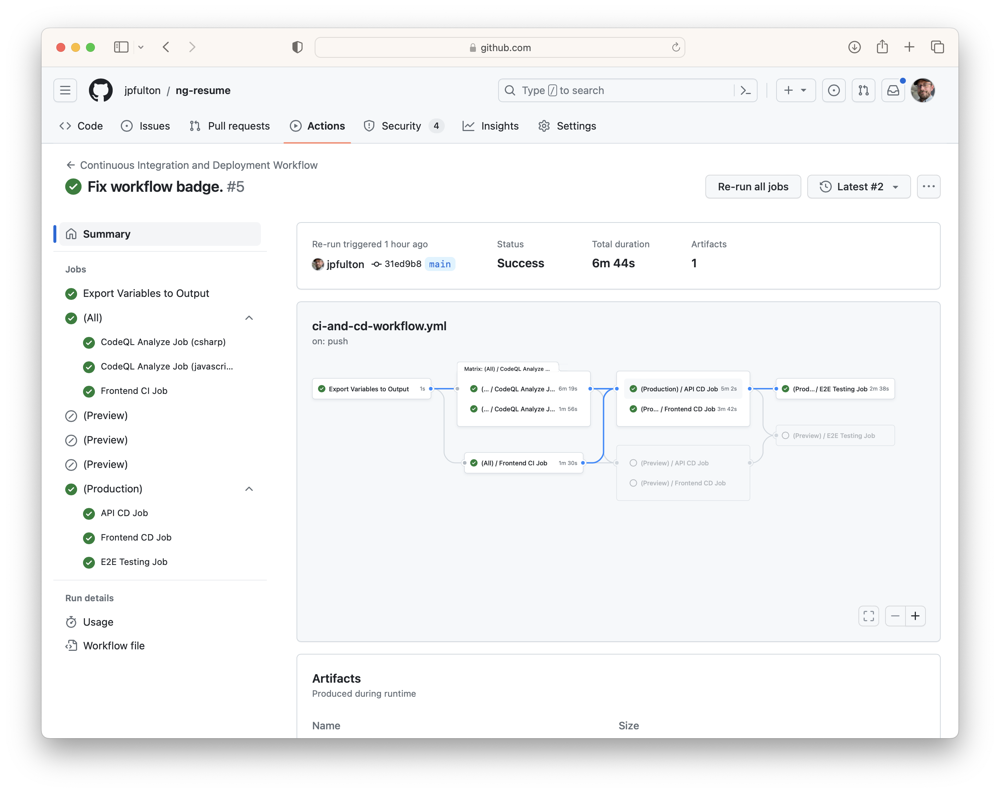
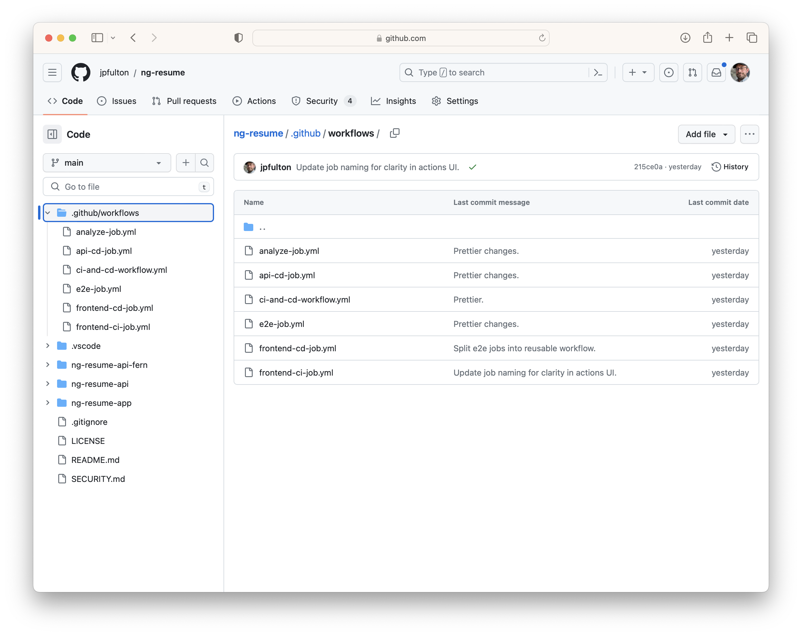

[GitHub Actions](https://github.com/features/actions)
workflows are implemented in
[YAML](https://yaml.org)
which is a format absent of functions making it hard to utilize the
[DRY principle](https://en.wikipedia.org/wiki/Don%27t_repeat_yourself)
when creating complex workflow configurations. Even in small enterprise examples,
it is easy for a workflow definition to get out of hand with repeating similar
blocks of code, a lack of modularity and lengthy workflow definition files.
While YAML itself does not
provide an easy solution to this problem, GitHub Actions includes a feature
that allows complex workflows to be decomposed into reusable and parameterized
modules:
[reusable workflows](https://docs.github.com/en/actions/using-workflows/reusing-workflows).

This article covers the refactoring of a complex workflow implemented in
GitHub Actions from a single YAML file with many repeated similar blocks of code
into a modular design using multiple reusable workflows and a single
top-level caller.

The
[original workflow definition](https://github.com/jpfulton/ng-resume/blob/f914a2063b1146d44cf6f3654d327ae9ca3c186e/.github/workflows/ci-and-cd.yml)
grew organically over time, developed a number of problems and was quickly
becoming difficult to maintain. The scope of what the workflow needed to
accomplish was not even particularly large for a real-world piece of enterprise
software. It included:

- 493 lines in a single workflow file
- 12 environment configuration variables
- 4 repository secrets
- 8 jobs
- 47 total steps



The objective of this workflow is to deploy an
[Azure Static Web App](https://azure.microsoft.com/en-us/products/app-service/static)
containing an
[Angular](https://angular.io/) application and linked
[Azure Functions App](https://azure.microsoft.com/en-us/products/functions/)
implementing its backend API.
It works with two separate environments: production and preview.
When a `push` is made to the default branch, the production environment should be
built and deployed. When a pull request into the default branch is created or updated,
the preview environment should be built and deployed. Several other jobs including
unit testing for the frontend application,
[CodeQL](https://codeql.github.com/)
analysis for the code base and
a series of end-to-end deployment sanity tests are also included in the workflow.

For reference, the original workflow file
can be found in its state prior to refactoring at this
[location](https://github.com/jpfulton/ng-resume/blob/f914a2063b1146d44cf6f3654d327ae9ca3c186e/.github/workflows/ci-and-cd.yml).
The resulting series of files that were the output of the refactoring can be found
in this
[commit](https://github.com/jpfulton/ng-resume/commit/897c77ecb25fe313b35d4f5a3d8b9da60c276d9b).

## Table of Contents

## Use the GitHub Actions VS Code Extension

The
[GitHub Actions Extension](https://marketplace.visualstudio.com/items?itemName=github.vscode-github-actions)
for [Visual Studio Code](https://code.visualstudio.com) is an incredible time saver
when working on workflows. It offers a number of features that come in handy:

- Syntax highlighting
- Integrated documentation
- Validation and code completion
- Parsing parameters, inputs, and outputs for referenced actions and reusable workflows

## Workflow Configuration Patterns

Even simple workflow files require configuration. Common practice is
to include a series of variables containing these configuration values
at the top of the workflow as environment variables. These environment
variables are then referenced throughout the rest of the workflow as needed.

However, when decomposing a large workflow into small units using the
reusable workflow feature, another similar pattern is needed.
Reusable workflows have a series of
[limitations](https://docs.github.com/en/actions/using-workflows/reusing-workflows#limitations).
Among those limitations is the note that environment variables are not
passed from the calling workflow to the reusable workflow. Additionally,
the `env`
[context](https://docs.github.com/en/actions/learn-github-actions/contexts)
is not available in the `with` block of the caller.

> Any environment variables set in an env context defined at the workflow level
> in the caller workflow are not propagated to the called workflow.

As a result, another pattern is required: the use of output variables from
a previously executed job.

### Configuration through Environment Variables

Environment variables may be set at the workflow, job and step levels
using the `env` context. In a single file workflow pattern, it is common
to set environment variables used throughout the workflow for configuration
at the top of the workflow file. These variables are then accessed when needed
using the `${{ env.APP_WORKING_DIR }}` syntax.

The
[original workflow definition](https://github.com/jpfulton/ng-resume/blob/f914a2063b1146d44cf6f3654d327ae9ca3c186e/.github/workflows/ci-and-cd.yml)
used in this project followed this pattern prior to the refactoring.

```yaml
env:
  APP_WORKING_DIR: "ng-resume-app"
  APP_LOCATION: "/ng-resume-app/dist/ng-resume/browser"
  API_LOCATION: ""
  OUTPUT_LOCATION: ""
  AZURE_FUNCTIONAPP_NAME: "personal-site-api"
  PREVIEW_AZURE_FUNCTIONAPP_NAME: "personal-site-api-preview"
  AZURE_FUNCTIONAPP_PACKAGE_PATH: "ng-resume-api"
  DOTNET_VERSION: "7.0.x"
  RESOURCE_GROUP: "personal-site"
  SLOT_NAME: "staging"
  BASE_URL: "https://www.jpatrickfulton.com"
  PREVIEW_BASE_URL: "https://preview.jpatrickfulton.com"
```

### Configuration through Job Output Variables

Due to the limitations discussed above, the standard pattern of workflow-level
environmental configuration variables **does not work** in a workflow that is
decomposed into multiple reusable workflows. However, environment variables may still
prove useful _within_ a workflow file or _within_ a self contained job or step.

**An alternate pattern is required in a reusable workflow pattern.** The `env` context
is not available. However, several other
[contexts](https://docs.github.com/en/actions/learn-github-actions/contexts#needs-context)
are available including the `jobs` and `needs` contexts.

> The `needs` context contains outputs from all jobs that are defined as
> a direct dependency of the current job.

The solution is to define a job in the calling workflow that declares a series
of `outputs` that contain the configuration data. Subsequent jobs that require
these variables may declare a dependency on that job using a `needs` clause.
For example, a subsequent job in the workflow may declare `needs: [export_vars]`
and then access the values of the configuration variables using
the following syntax: `${{ needs.export_vars.outputs.app-working-dir }}`.

The
[updated calling workflow](https://github.com/jpfulton/ng-resume/blob/main/.github/workflows/ci-and-cd-workflow.yml)
uses this pattern to pass configuration data to jobs and steps in the
reusable workflows that were split from the original workflow.

```yaml
jobs:
  export_vars:
    name: Export Variables to Output
    runs-on: ubuntu-latest
    outputs:
      app-working-dir: "ng-resume-app"
      app-location: "/ng-resume-app/dist/ng-resume/browser"
      api-location: ""
      output-location: ""
      azure-functionapp-name: "personal-site-api"
      preview-azure-functionapp-name: "personal-site-api-preview"
      azure-functionapp-package-path: "ng-resume-api"
      dotnet-version: "7.0.x"
      resource-group: "personal-site"
      slot-name: "staging"
      base-url: "https://www.jpatrickfulton.com"
      preview-base-url: "https://preview.jpatrickfulton.com"
    steps:
      - run: echo "Exporting variables to outputs."
```

## Applying Reusable Workflows

Reusable workflows in GitHub Actions allow the developer to create modular
and parameterized units of work to decompose a complex workflow. This overcomes
the absence of functions in the YAML specification. A monolithic single workflow
file can be subdivided into multiple reusable workflows each of which can be
passed inputs to control their flow and configuration.

### Creating a Reusable Workflow

Reusable workflows must be created in the `.github/workflows/` folder. Notably,
the use of subdirectories under that folder is not supported. A reusable workflow
is structured in the same fashion as a traditional workflow including an `on` block
and a `jobs` block including at least one job.

What differentiates a reusable workflow is the trigger included in the `on` block.
To create a reusable workflow, the `on` block must include a `workflow_call` trigger.
This section, optionally composed of `inputs` and `secrets` that can be passed
to the workflow by its callers, marks the workflow in GitHub as callable by other
workflows.

Input variables are declared in the `inputs` block. Each input variable may be marked
as required and declares an associated type. Only `boolean`, `number` and `string`
types may be used. **Sequence types are not currently supported.** At the start of
workflow execution, the parser examines the required inputs and should one be
missed by a caller or of an incorrect type, the workflow will generate errors
before hitting the runner. Input variables may be referenced later in the reusable
workflow file using the following syntax and the inputs context:
`${{ inputs.dotnet-version }}`.

Secrets may also either be passed or **inherited**.

> If the secrets are inherited by using `secrets: inherit` in the calling
> workflow, you can reference them even if they are not explicitly defined
> in the on key.

The advantage to explicit
passing of secrets, as shown in this example, is that caller may elect to choose
which secret value to pass to the reusable workflow. In the complete example
used here, there are two Azure Service Principal secrets within the caller:
one for the production environment and one for the preview environment. The caller
then selects the correct secret to explicitly pass to the reusable workflow
thereby abstracting logic about which secret to use into the calling workflow.

In either case, once secrets have been passed to the underlying reusable workflow,
they may be accessed for use with the following syntax:
`${{ secrets.azure-sp-credentials }}`.

```yaml {3,4,9,13}{numberLines: true}
name: Reusable API CD Workflow
on:
  workflow_call:
    inputs:
      dotnet-version:
        required: true
        type: string
      ...
    secrets:
      azure-sp-credentials:
        required: true

jobs:
  api_cd_job:
    name: API CD Job
    permissions:
      contents: read
      pull-requests: write
    runs-on: windows-latest
    steps:
      - name: "Checkout GitHub Action"
        uses: actions/checkout@v3
      ...
```

The complete version of this reusable workflow is available
[here](https://github.com/jpfulton/ng-resume/blob/main/.github/workflows/api-cd-job.yml).

### Creating a Caller Workflow

In a caller workflow that invokes a separate reusable workflow, the caller
defines a job and adds a `uses` key to it. Beneath the `uses` key, the caller
passes input variables in a `with` block followed by any necessary secrets
in a `secrets` block.

In this example, the reusable workflow exists in the same repository as the caller
and the desired outcome is to use a version of that reusable workflow that exists
on the same branch and commit as the caller. This is accomplished with the following
syntax: `uses: ./.github/workflows/api-cd-job.yml`.

However, reusable workflows can also be accessed from other sources from a `uses`
clause. Per the [documentation](https://docs.github.com/en/actions/using-workflows/reusing-workflows#calling-a-reusable-workflow),
reusable workflows from other repositories may be used with the following
syntax: `uses: {owner}/{repo}/.github/workflows/{filename}@{ref}`. The
`{ref}` may be a commit SHA, a release tag, or a branch name.

> Using the commit SHA is the safest for stability and security.

The documentation encourages consumers of reusable workflows in separate
repositories or from third parties to refer to the
[security hardening document](https://docs.github.com/en/actions/security-guides/security-hardening-for-github-actions#using-third-party-actions)
as the risks associated with a compromised workflow are _**significant**_.

In this example, you can see the pattern referenced in earlier sections of this
article to utilize output variables from a previously executed job to configure
the inputs to the reusable workflow.

```yaml {3,8,9,15}{numberLines: true}
preview_api_cd_job:
  name: (Preview)
  needs: [export_vars, analyze, frontend_ci_job]
  if: (github.event_name == 'pull_request' && github.event.action != 'closed')
  permissions:
    contents: read
    pull-requests: write
  uses: ./.github/workflows/api-cd-job.yml
  with:
    dotnet-version: ${{ needs.export_vars.outputs.dotnet-version }}
    function-app-name: ${{ needs.export_vars.outputs.preview-azure-functionapp-name }}
    function-app-package-path: ${{ needs.export_vars.outputs.azure-functionapp-package-path }}
    resource-group: ${{ needs.export_vars.outputs.resource-group }}
    slot-name: ${{ needs.export_vars.outputs.slot-name }}
  secrets:
    azure-sp-credentials: ${{ secrets.PREVIEW_AZURE_SP_CREDENTIALS }}
```

The complete version of this caller workflow is available
[here](https://github.com/jpfulton/ng-resume/blob/main/.github/workflows/ci-and-cd-workflow.yml).

### A Complete View of the Refactoring Results

By splitting the original workflow file into a caller and then a series of
reusable workflows, the main file was made significantly more maintainable,
readable and modular. The environment variables were converted to job output
variables using the pattern discussed above and configuration for the workflow
remains in-file as a result. The output of the final refactoring can be found
in this
[folder](https://github.com/jpfulton/ng-resume/tree/main/.github/workflows).
Following the refactoring, it now includes:

- 1 top-level caller workflow (174 lines)
- 5 reusable workflows leveraged by the caller
- 12 configuration variables converted to job output variables
- 4 repository secrets
- 9 jobs (including the new variable output job)
- 48 total steps



| File                                                                                                               | Description                                                                   |
| ------------------------------------------------------------------------------------------------------------------ | ----------------------------------------------------------------------------- |
| [analyze-job.yml](https://github.com/jpfulton/ng-resume/blob/main/.github/workflows/analyze-job.yml)               | A reusable workflow containing a CodeQL analysis job.                         |
| [api-cd-job.yml](https://github.com/jpfulton/ng-resume/blob/main/.github/workflows/api-cd-job.yml)                 | A reusable workflow containing a CD job for function APIs.                    |
| [ci-and-cd-workflow.yml](https://github.com/jpfulton/ng-resume/blob/main/.github/workflows/ci-and-cd-workflow.yml) | The top-level caller workflow for the complete CI/CD process for the project. |
| [e2e-job.yml](https://github.com/jpfulton/ng-resume/blob/main/.github/workflows/e2e-job.yml)                       | A reusable workflow containing an E2E testing job.                            |
| [frontend-cd-job.yml](https://github.com/jpfulton/ng-resume/blob/main/.github/workflows/frontend-cd-job.yml)       | A reusable workflow containing a CD job for the frontend application.         |
| [frontend-ci-job.yml](https://github.com/jpfulton/ng-resume/blob/main/.github/workflows/frontend-ci-job.yml)       | A reusable workflow containing a CI job for the frontend application.         |
