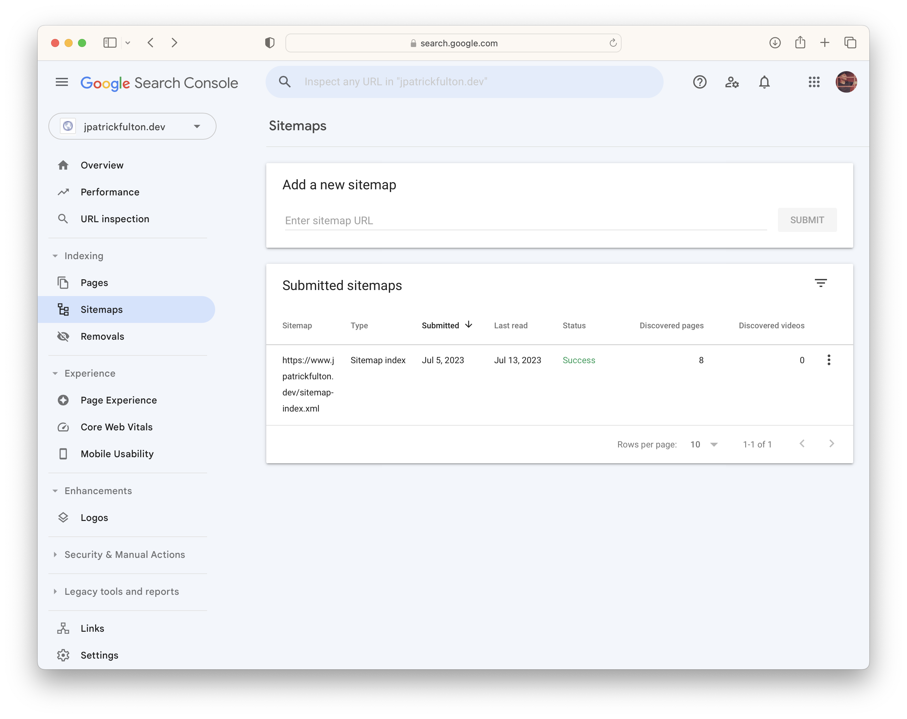
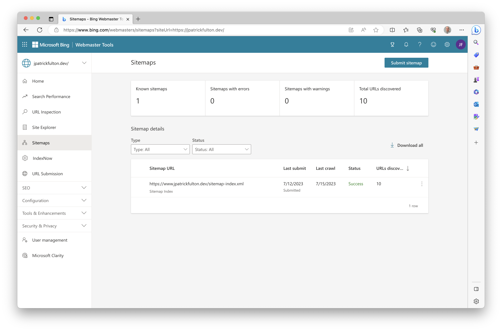

[Gatsby](https://www.gatsbyjs.com/)
offers a
[sitemap plugin](https://github.com/gatsbyjs/gatsby/tree/master/packages/gatsby-plugin-sitemap)
to generate sitemap XML documents for the sites
it generates. However, in its default configuration, it needs customization to be
useful to most search engines. Luckily, it is possible to change the default
configuration and supplement its logic with both other plugins and custom logic.
In this post, I cover how to leverage Git commits to update the sitemap and
introduce last modification dates to each URL entry.

The evolving **GitHub repository** storing this blog and its implementation can be
found [here](https://github.com/jpfulton/blog).

## Table of Contents

## The Default Sitemap Plugin Output

Using the default configuration of the `gatsby-plugin-sitemap` plugin, the following
output can be expected. The `changefreq` and `priority` tags will contain the same
value for all URLs and no `lastmod` tag is generated.

Per the
[Google documentation](https://developers.google.com/search/docs/crawling-indexing/sitemaps/build-sitemap):

> Google ignores `<priority>` and `<changefreq>` values.
>
> Google uses the `<lastmod>` value if it's consistently and verifiably accurate

```xml {5-6, 10-11}{numberLines: true}
<?xml version="1.0" encoding="UTF-8"?>
<urlset xmlns="http://www.sitemaps.org/schemas/sitemap/0.9">
  <url>
    <loc>https://example.net/blog/</loc>
    <changefreq>daily</changefreq>
    <priority>0.7</priority>
  </url>
  <url>
    <loc>https://example.net/</loc>
    <changefreq>daily</changefreq>
    <priority>0.7</priority>
  </url>
</urlset>
```

## The Desired Sitemap Output

In a desired state, the `changefreq` and `priority` tags would be omitted
and a `lastmod` tag would contain a timestamp that accurately reflected
the last change in content that was made to that page.

```xml:title=sitemap-0.xml {4,8}{numberLines:true}
<urlset xmlns="http://www.sitemaps.org/schemas/sitemap/0.9" xmlns:news="http://www.google.com/schemas/sitemap-news/0.9" xmlns:xhtml="http://www.w3.org/1999/xhtml" xmlns:image="http://www.google.com/schemas/sitemap-image/1.1" xmlns:video="http://www.google.com/schemas/sitemap-video/1.1">
  ...
  <url>
    <loc>https://www.jpatrickfulton.dev/blog/2023-06-23-samba-and-timemachine/</loc>
    <lastmod>2023-07-10T02:48:04.000Z</lastmod>
  </url>
  <url>
    <loc>https://www.jpatrickfulton.dev/</loc>
    <lastmod>2023-07-17T01:25:59.000Z</lastmod>
  </url>
</urlset>
```

## The Plugins

To accomplish our goals of removing the unneeded tags and introducing a
last modification timestamp that is based on the Git commit that last changed
the content of a page we need two plugins: the official `gatsby-plugin-sitemap`
plugin and a plugin from the community `gatsby-plugin-git-lastmod`.

- [gatsby-plugin-sitemap](https://github.com/gatsbyjs/gatsby/tree/master/packages/gatsby-plugin-sitemap)
- [gatsby-plugin-git-lastmod](https://github.com/vondenstein/gatsby-plugin-git-lastmod/tree/main)

## Configuring the Plugins

The `gatsby-plugin-git-lastmod` may be used without additional configuration values.
It is `MDX` compatible and will introduce a new node to the `pageContext` object
to carry the last timestamp of the Git modification to the source file generating
a page or blog post using its [gatsby-node.js](https://github.com/vondenstein/gatsby-plugin-git-lastmod/blob/main/src/gatsby-node.js#L33)
file.

In the listing below, the `query` options parameter is configured to return
the `pageContext` object and a custom `serialize` function is provided that
both omits the unneeded tags and introduces the desired `lastmod` tag. This
configuration will generate correct entries for all blog postings.

```javascript:title=gatsby-config.mjs {numberLines: true}
plugins: [
  {
    resolve: `gatsby-plugin-sitemap`,
    options: {
      query: `
      {
        site {
          siteMetadata {
            siteUrl
          }
        }
        allSitePage {
          nodes {
            path
            pageContext
          }
        }
      }
      `,
      serialize: ({ path, pageContext }) => {
        return {
          url: path,
          lastmod: pageContext?.lastMod,
        };
      },
    },
  },
  `gatsby-plugin-git-lastmod`,
  ...
]
```

## Handling Last Modification Date for the Index Page

The outlier case is that of the index page. Using _only_ the configuration
from above, the `lastmod` timestamp of the index page would only
update when code changes were made to alter its structure. However, the
index page **actually** changes upon alteration to any of the blog
pages that it links.

To address this case, we need to introduce some custom code to our
own `gatsby-node.js` file with logic similar to the logic contained
in the `gatsby-plugin-git-lastmod` plugin. Note that in earlier
commits, this implementation converted the `gatsby-node.js` file to use
[ES module syntax](https://developer.mozilla.org/en-US/docs/Web/JavaScript/Guide/Modules)
for better compatibility with the
[MDX plugin](https://github.com/gatsbyjs/gatsby/tree/master/packages/gatsby-plugin-mdx)
in Gatsby v5+.

The code below keep track of the latest timestamp on which a blog entry was
modified then uses that value to set an override to the index page's
last modification timestamp.

```javascript:title=gatsby-node.mjs {numberLines: true}{clipboardButton: true}
const simpleGit = require(`simple-git`);
let latestBlogModification = new Date(1900, 1, 1);

export const onCreatePage = async ({ page, actions }) => {
  if (page.component.includes("blog-post.js")) {
    // looking for mdx blog posts
    const filePath = page.component.split("?__contentFilePath=").pop();
    const fileLog = await simpleGit().log({
      file: filePath,
      maxCount: 1,
      strictDate: true,
    });

    // update latestBlogModification date
    const gitLogDate = new Date(fileLog?.latest?.date);
    if (latestBlogModification < gitLogDate) {
      latestBlogModification = gitLogDate;
    }

    return;
  }

  // blogs are processed first, elements under src/pages/ second
  // allows the accurate setting of the lastBlogModification module
  // variable
  if (page.path === "/") {
    // looking only for the root index page
    const { createPage } = actions;
    return createPage({
      ...page,
      context: {
        ...page.context,

        // set the lastMod key to override the value that would
        // have been set in the gatsby-plugin-git-lastmod plugin
        // for use in sitemap generation
        lastMod: latestBlogModification.toISOString(),
      },
    });
  }
};
```

The complete version of this file for this site implementation can be found
[here](https://github.com/jpfulton/blog/blob/main/gatsby-node.mjs).

## Updating Robots.txt

In a final step, to ease the crawling of the site by search engines,
the `robots.txt` file may be modified to include a fully qualified URL
to the sitemap output. This file will be hosted on the root of the site
and is placed in the `/static/` folder in the source tree.

```txt:title=robots.txt {5}{numberLines: true}
User-agent: *
Disallow: /8846484b349642449a66629f496422f8.txt
Disallow: /rss.xml

Sitemap: https://www.jpatrickfulton.dev/sitemap-index.xml
```

## Submitting Sitemaps

While search engine crawlers will look for sitemaps on the root of
your site, directly submitting your sitemap to each search engine
can accelerate the process of crawling.

### Submitting a Sitemap to Google

Using the
[Google Search Console](https://search.google.com/search-console/),
navigate on the right-hand navigation menu to **Sitemaps** and add a
new sitemap.



### Submitting a Sitemap to Bing

Using the
[Bing Webmaster Tools](https://www.bing.com/webmasters/),
navigate to **Sitemaps** > **Submit sitemap** to add a sitemap URL.


