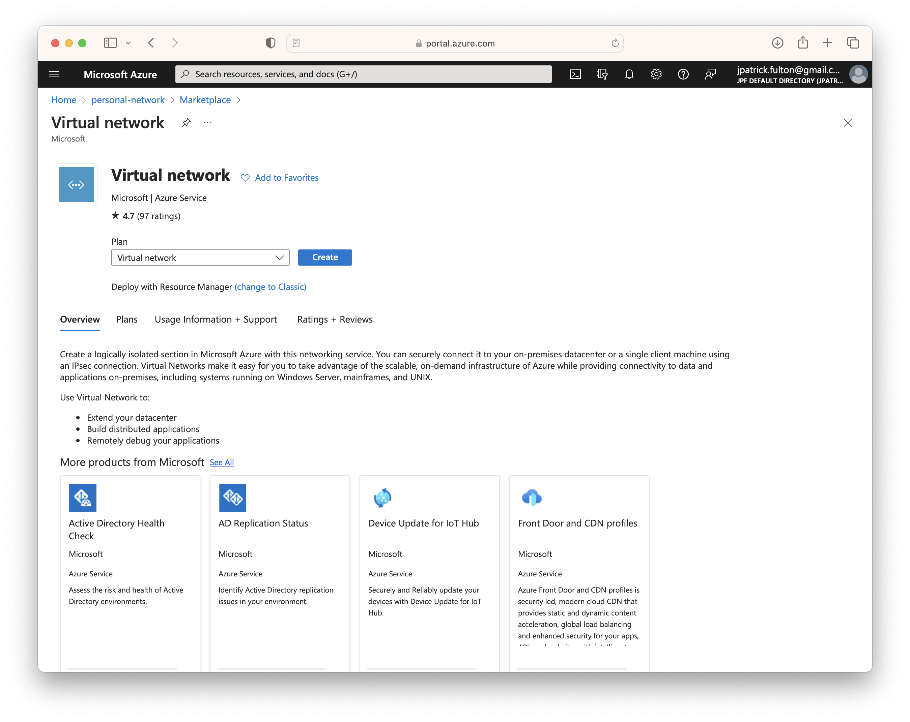
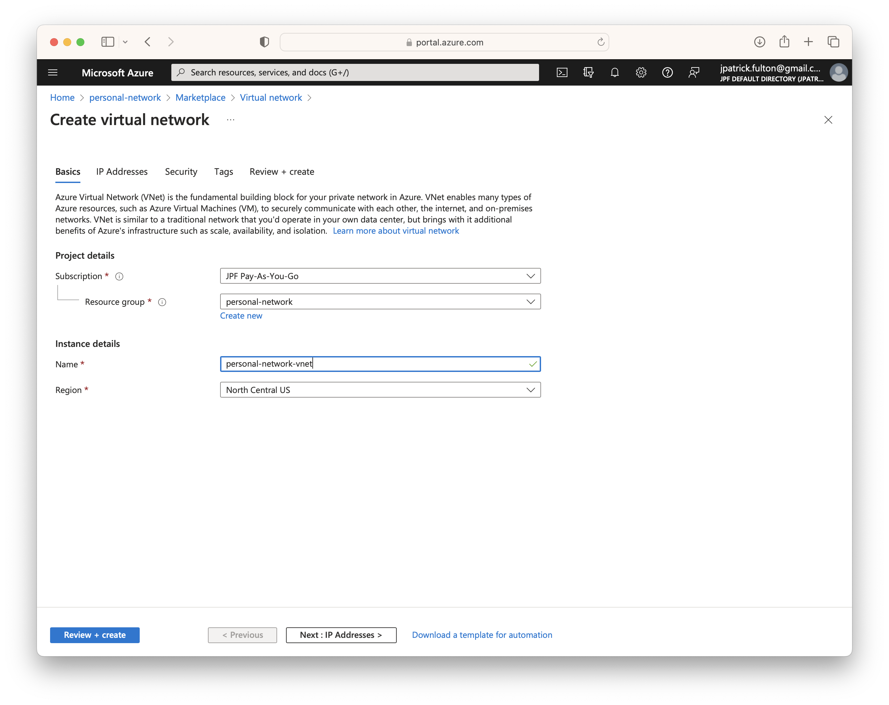
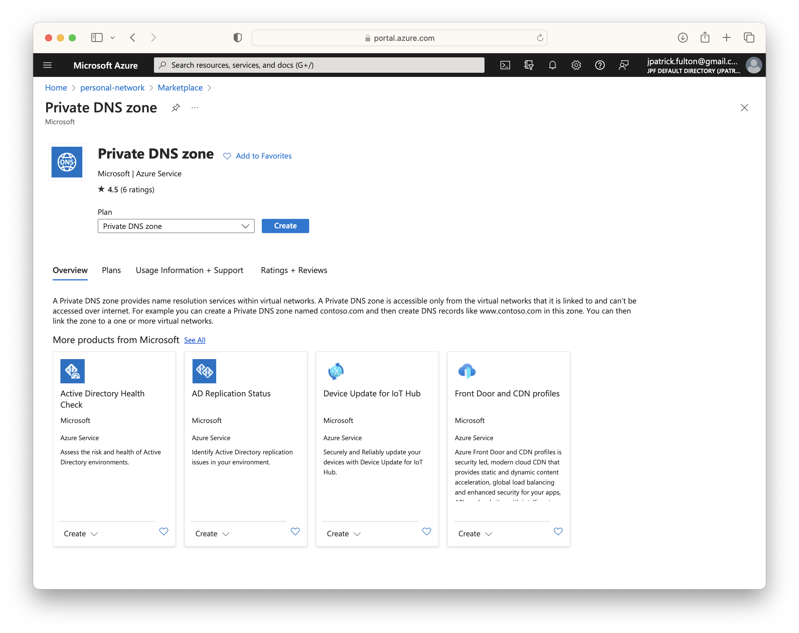
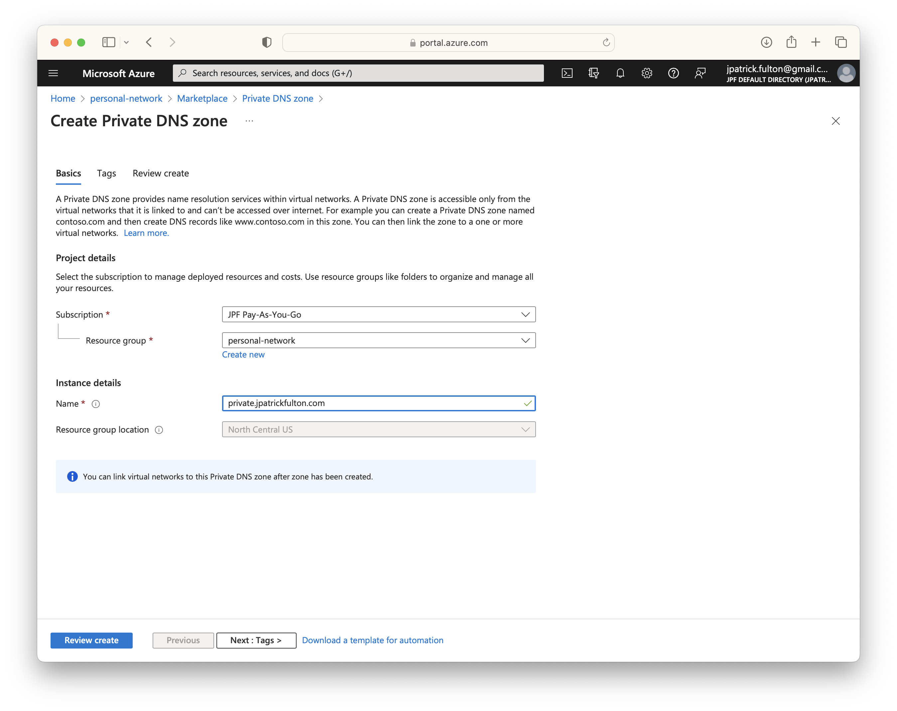
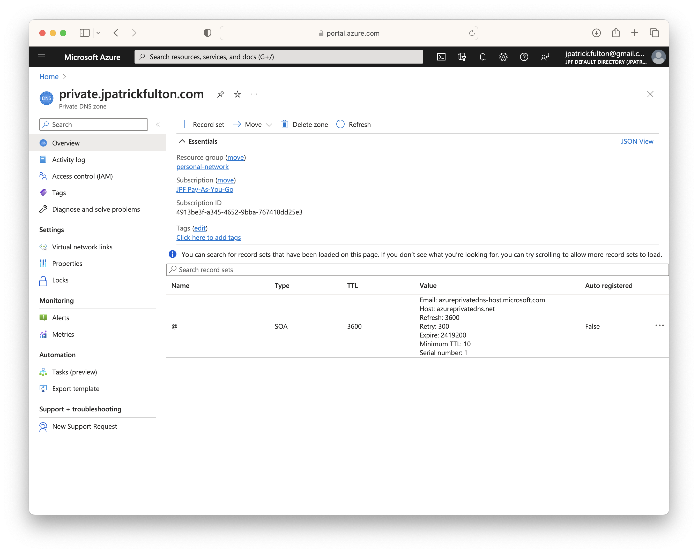
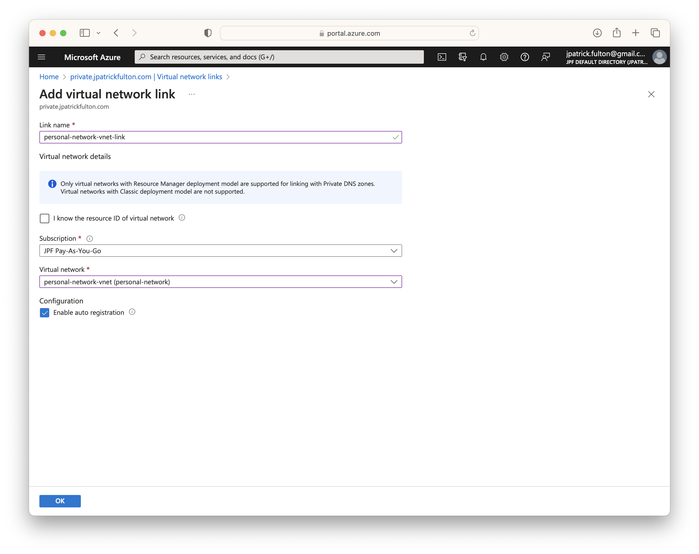
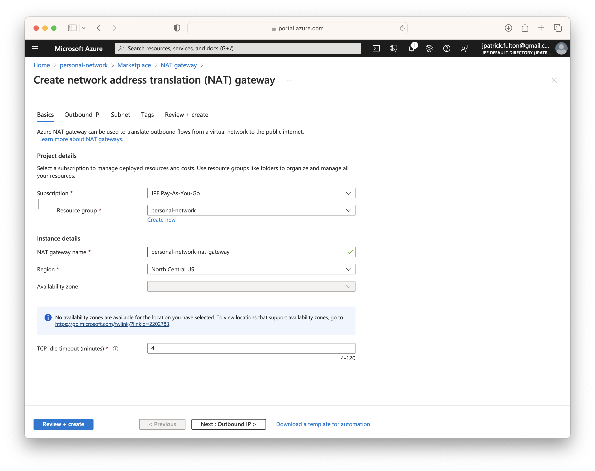
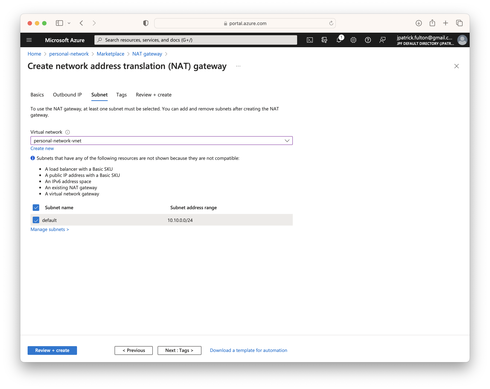

import SeriesLinks from "../2023-07-18-azure-personal-network/seriesLinks.js"

<SeriesLinks />

## Table of Contents

## Create a Resource Group

First, we need a resource group to store the resources that will be created for
the network and virtual machines it will contain. Resource groups are logical
containers for Azure resources. They provide a grouping mechanism and are also
useful in cost tracking. Each resource group is associated with a default region
for the resources that are created within it. However, they may contain resources
from a variety of Azure regions.

From the Azure portal home screen, select **Create a resource** and search for
**resource group** to create the container. Provide a name and select a default
region.

## Create a Virtual Network

The first resource needed for this project is a virtual network. A virtual network
is similar to a traditional network. However, its simulated nature brings isolation
and allows resources like virtual machines to communicate securely with one
another in the Azure cloud. In this case, we wish to create a network that is
address in way that is compatible with our home network to avoid the need to
perform routing tricks for overlapping address spaces. We will start with a large
address space and create a single starting subnet.

From the resource group that was created above, we will select **Create** and
navigate to the marketplace to search for **virtual network**. Select the
**Virtual Network** option to begin the creation process.

In the first step, select a name for the network resource. Region will be
pre-populated from the default region for the resource group.

Enter an address space. In this example, I use a large one: `10.10.0.0/16` to allow
for the future creation of several subnets. Create a default subnet with a `/24`
mask. In a later step, a NAT gateway will be created to allow the network to communicate
with the internet without the use of public IPs associated with each virtual machine
NIC.

Select **Review + create** to validate the resource and begin deployment.

## Create and Link a Private DNS Zone

An Azure Private DNS Zone provides name resolution and management within a
virtual network. By default, each virtual machine deployed to a virtual
network is resolvable within the network under as
`virtual-machine-name.internal.cloudapp.net`. However, using a private DNS
zone this can be customized without the need for a custom DNS solution.

> The records contained in a private DNS zone aren't resolvable from the Internet.
> DNS resolution against a private DNS zone works only from virtual networks that
> are linked to it.

In this project, we wish to resolve machine names against
`*.private.jpatrickfulton.com`. To start to create the private DNS zone, begin
on the resource group created above and select **Create**. Search for
**private dns zone** in the market place and begin the configuration process.

Once you have named the private DNS zone, select **Review + create**. Linking
the zone to virtual networks is performed in separate a separate step.

Following the creation of the zone, select **Virtual network links** from the menu
on the right-hand side to begin the linking process.

Provide a link name and select the virtual network created in the steps above. Be
sure to select **Enable auto registration** to allow records to be created and
maintained automatically when new resources are added to the virtual network.

## Create a NAT Gateway

Most of the resources that will be created in this project will not have
associated public IP addresses to utilize when communicating with the internet.
As a result, we need a NAT (network address translation) gateway for the network
to facilitate outbound connectivity.

> Azure NAT Gateway is a fully managed and highly resilient Network Address
> Translation (NAT) service. You can use Azure NAT Gateway to let all instances
> in a private subnet connect outbound to the internet while remaining fully private.
> Unsolicited inbound connections from the internet aren't permitted through a
> NAT gateway. Only packets arriving as response packets to an outbound connection
> can pass through a NAT gateway.

To begin start
on the resource group created above and select **Create**. Search for
**nat gateway** in the market place and begin the configuration process.

The NAT gateway will require a public IP to be associated with it. Allow
a new one to be created and select **Next**.

Associate the NAT gateway with the virtual network and subnet created
above. Select **Review + create** to begin the deployment.

