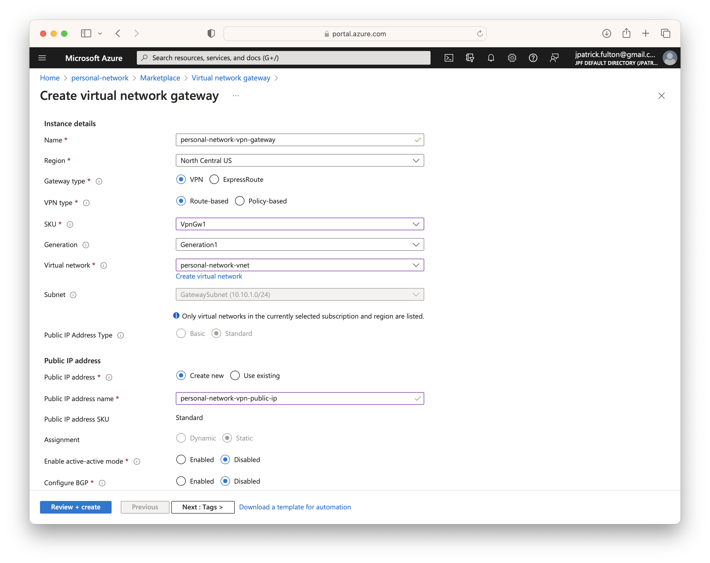
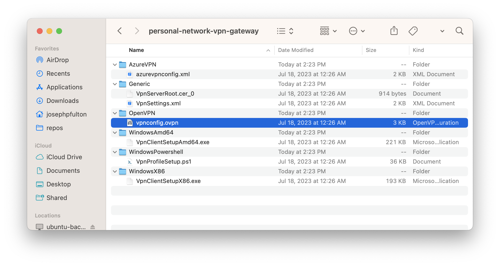

The
[Azure VPN Gateway](https://azure.microsoft.com/en-us/products/vpn-gateway)
is a high availability resource designed to provide virtual private networking
tunnels to Azure virtual networks. It can be configured to connect an on-premise
network to the cloud and also to support point-to-site clients. Among its primary
advantages is the ability to manage the resource through the Azure Portal or
Azure CLI. In this post, we will create an Azure VPN Gateway to connect an
on-premise network to a virtual network in the cloud.

With support for OpenVPN, IKEv2 and/or SSTP, the Azure VPN Gateway is implemented
through two or more Azure-managed virtual machines that are placed on a `GatewaySubnet`
within the virtual network.

Selecting the correct SKU is important while setting up the resource. The monthly
cost differences are significant between various models of the resource as are
the capabilities, aggregate bandwidth support and management features. While
the `Basic` SKU is most economical, it has limited features and cannot support
the `IKEv2` and `OpenVPN` tunnel types which provide cross-platform support
in a point-to-site configuration. Additionally, resources of the `Basic` SKU
cannot be resized to other SKUs. They must first be deleted and new resources
created in their place. To provide cross-platform support, this post will use the
`VpnGw1`.

As this type of Azure resource is best suited for enterprise applications,
later this post series, we will replace the VPN gateway resource with a
custom implementation based on a self-managed Ubuntu virtual machine. If you
wish to skip ahead, that post is
available <Link to="/blog/2023-07-21-azure-personal-network-replace-vpn/">here</Link>.

import SeriesLinks from "../2023-07-18-azure-personal-network/seriesLinks.js"

<SeriesLinks />

## Table of Contents

## Create a VPN Gateway

From the resource group created in
the <Link to="/blog/2023-07-19-azure-personal-network-vnet/">previous post</Link>,
select **Create** from the toolbar and search for **VPN Gateway** in the marketplace.

Enter a name for the resource, select `VpnGw1` for the SKU and select the correct
virtual network. Select **Review + create** to validate and start the deployment.



## Configure the VPN Gateway

Once the resource is created, which may take several minutes, there are a number
of configuration steps that must be taken to generate certificates, create
client configuration files and set up the point-to-site feature. These steps
were taken on an on-premise Ubuntu Linux server running `Ubuntu 22.04.2 LTS`.
Select a location where the generated keys may be kept _**securely**_ and
revisited as new client certificates are needed.

### Generate a Root Certificate

The following steps are adapted from this Azure
[guide](https://learn.microsoft.com/en-us/azure/vpn-gateway/vpn-gateway-certificates-point-to-site-linux)
with modification to correct errors and problems encountered on the
on-premise key management server.

First, install the dependencies for key generation using the following commands.

```bash
sudo apt update
sudo apt install strongswan
sudo apt install strongswan-pki
sudo apt install libstrongswan-extra-plugins
sudo apt install libtss2-rc0
```

Next, generate a certificate authority for use with the VPN gateway.

```bash
ipsec pki --gen --outform pem > caKey.pem
ipsec pki --self --in caKey.pem --dn "CN=VPN CA" --ca --outform pem > caCert.pem
```

Once the CA has been created, output its public key in `base64` format to
a text file. We will need the contents of this file when copying the
public certificate into the Azure portal in the next step.

```bash
openssl x509 -in caCert.pem -outform der | base64 -w0 > my-root-cert.txt
```

### Configure Point-to-site

Navigate to the VPN gateway resource and select
**Settings** > **Point-to-site configuration**. Choose `IKEv2 and OpenVPN (SSL)`
from the tunnel type dropdown. Finally, paste the contents of `my-root-cert.txt`
as outputted from the previous command into the `Root certificates` section.
Select **Save** from the toolbar.


## Create a Client Configuration

### Download the Client Configuration Template

Once the save operation has completed, the **Download VPN Client** button will
be enabled. Click it to start the download of the client configuration template
archive. The contents of this `zip` file are shown below. The file contains
a template file for an OpenVPN connection that we will need to complete in
the next sections. Keep this archive _**securely**_ as it contains a
pre-shared secret even before it is configured with a client certificate and
private key.



### OpenVPN Client Configuration Template

Copy the `vpnconfig.ovpn` file from the archive to a separate location
to be edited. A sample of its contents is shown below. Note the sections
that need to be completed prior to use: `$CLIENTCERTIFICATE` and `$PRIVATEKEY`.
Once we generate a client certificate and key, we can paste their contents
into this file.

```sh
client
remote azuregateway-e287007a-007c-45ee-bbd1-a9f9f4ac4e9a-55b827be7af2.vpn.azure.com 443
verify-x509-name 'e287007a-007c-45ee-bbd1-a9f9f4ac4e9a.vpn.azure.com' name
remote-cert-tls server

dev tun
proto tcp
resolv-retry infinite
nobind

auth SHA256
cipher AES-256-GCM
persist-key
persist-tun

tls-timeout 30
tls-version-min 1.2
key-direction 1

log openvpn.log
verb 3

# P2S CA root certificate
<ca>
-----BEGIN CERTIFICATE-----
MIID...
-----END CERTIFICATE-----
</ca>

# Pre Shared Key
<tls-auth>
-----BEGIN OpenVPN Static key V1-----
8a50...
-----END OpenVPN Static key V1-----
</tls-auth>

# P2S client certificate
# Please fill this field with a PEM formatted client certificate
# Alternatively, configure 'cert PATH_TO_CLIENT_CERT' to use input from a PEM certificate file.
<cert>
$CLIENTCERTIFICATE
</cert>

# P2S client certificate private key
# Please fill this field with a PEM formatted private key of the client certificate.
# Alternatively, configure 'key PATH_TO_CLIENT_KEY' to use input from a PEM key file.
<key>
$PRIVATEKEY
</key>
```

### Generate a Client Key and Certificate

This section of the post is adapted from the following Azure
[guide](https://learn.microsoft.com/en-us/azure/vpn-gateway/point-to-site-vpn-client-cert-linux)
with modifications to work on the on-premise server and to script much of the process.

Create a script with the following contents in the same directory used to perform
the server certificate generation from above. Replace the value of the `USERNAME`
variable
to match the name of the client configuration you would like to create. Ideally,
each VPN client will be assigned its own certificate, name and private key.

```sh:title=gen-client-key.sh
#!/usr/bin/env bash
PASSWORD="password"
USERNAME="Home"

ipsec pki --gen --outform pem > "${USERNAME}Key.pem"
ipsec pki --pub --in "${USERNAME}Key.pem" | ipsec pki --issue --cacert caCert.pem --cakey caKey.pem --dn "CN=${USERNAME}" --san "${USERNAME}" --flag clientAuth --outform pem > "${USERNAME}Cert.pem"

openssl pkcs12 -in "${USERNAME}Cert.pem" -inkey "${USERNAME}Key.pem" -certfile caCert.pem -export -out "${USERNAME}.p12" -password "pass:${PASSWORD}"
```

Run the script and then execute the following command to create a plain
text version of the `p12` binary file. The contents of `profileinfo.txt` will
contain sections that must be pasted into the client configuration file.

```bash
openssl pkcs12 -in "Home.p12" -nodes -out "profileinfo.txt"
```

### Assemble the Client Configuration File

With a plain text version of the certificate and private key generated, we
can begin to assemble the client configuration file from the downloaded
template.

Two certificates and one private key will exist in the `profileinfo.txt` file.
The certificate that is required by the `ovpn` configuration file is the child
certificate. It can be identified by the line that begins with `subject=CN =` and
the value you inserted into the script for the `USERNAME` variable. Copy the
certificate section into the client configuration in place of the line containing
`$CLIENTCERTIFICATE`.

Next, find the private key that is included in `profileinfo.txt`. Copy it into the
`ovpn` configuration file over the line containing `$PRIVATEKEY`.

Save the file and transfer it to the client using a **secure** mechanism.

### Install the Configuration and Test a Client

With the client configuration downloaded to a local machine, one of several
OpenVPN clients can be configured and then used for testing.
[Ubuntu Desktop](https://ubuntu.com/download/desktop) includes an OpenVPN client.
Additionally,
[Tunnelblick](https://tunnelblick.net)
may be used on macOS and
[OpenVPN Connect](https://openvpn.net/client/client-connect-vpn-for-windows/) may be
used on Windows.

In a <Link to="/blog/2023-07-21-azure-personal-network-vpn-firewalla/">post</Link>
later in the series,
I will discuss setting up the client configuration on a
[Firewalla](https://firewalla.com) device.
