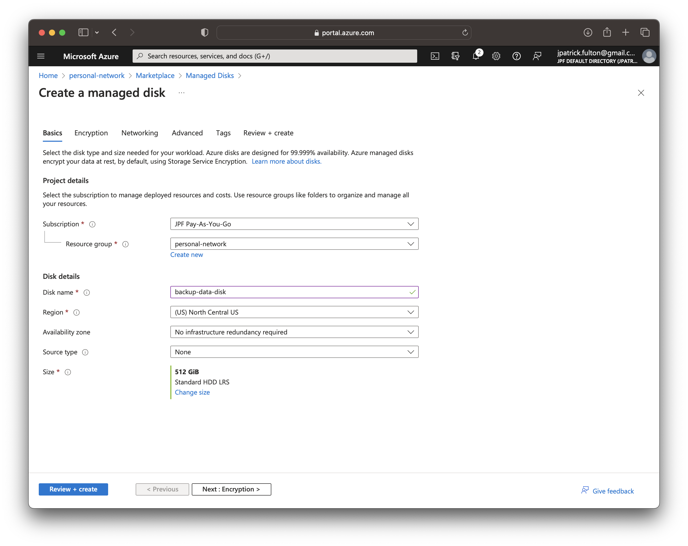
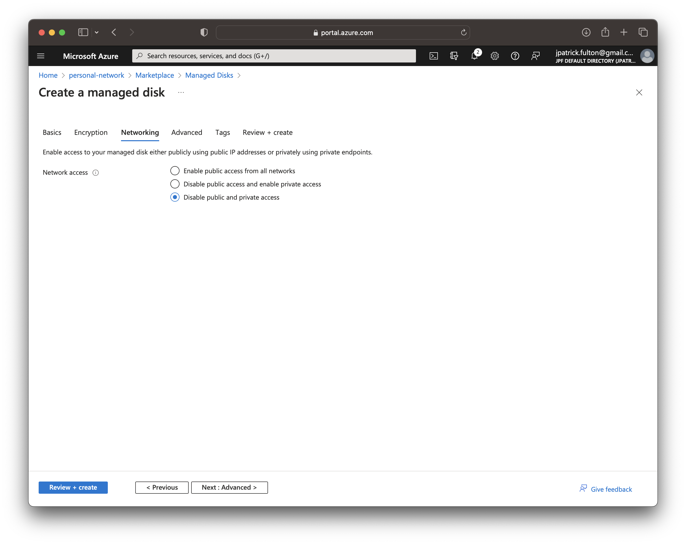
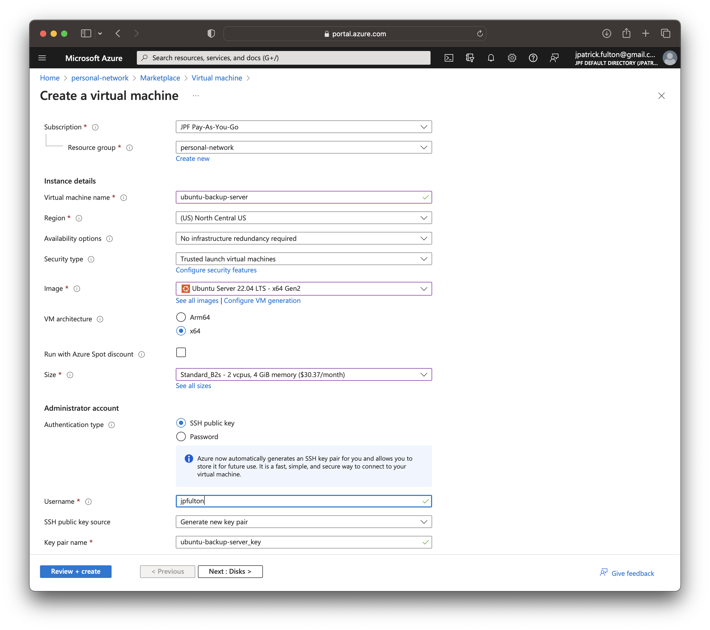
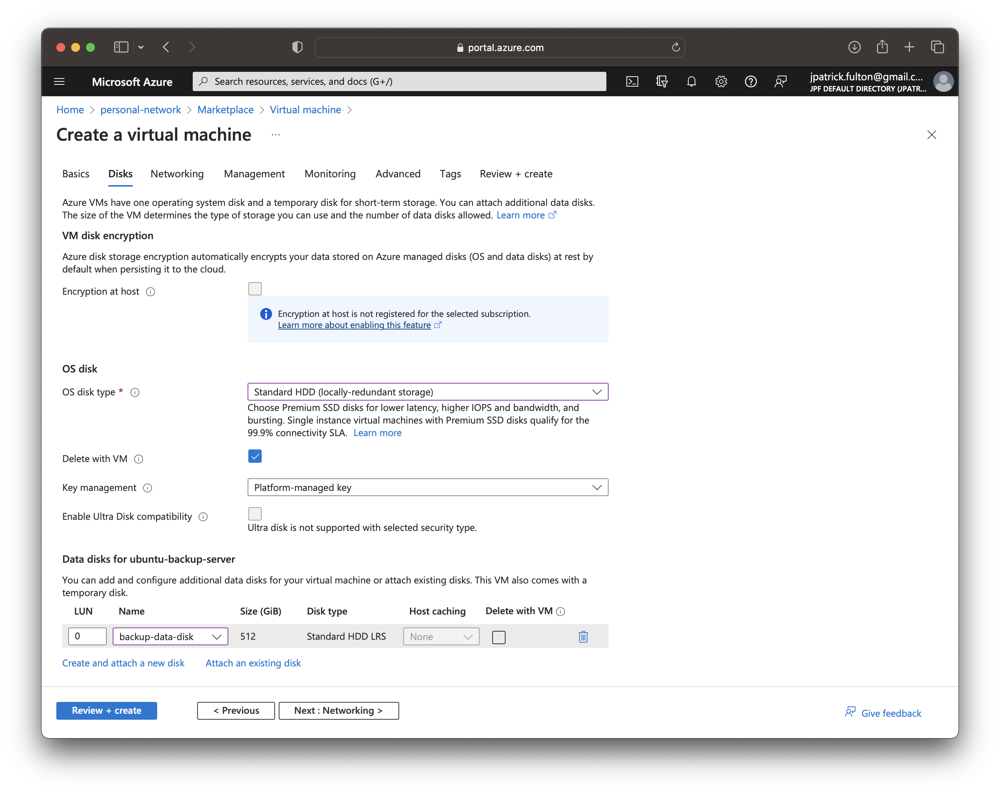
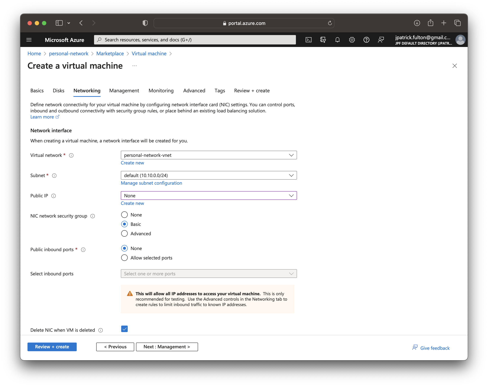
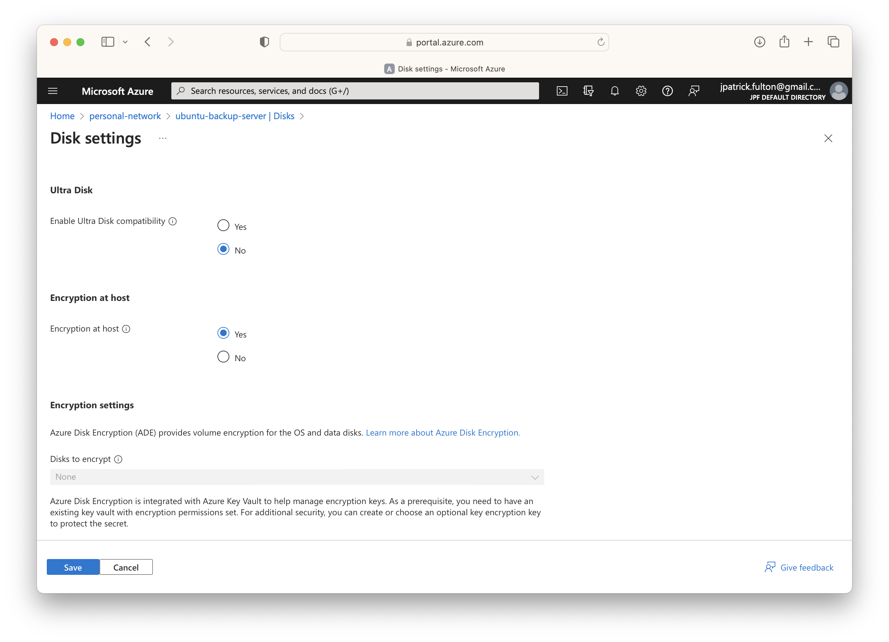

import SeriesLinks from "../2023-07-18-azure-personal-network/seriesLinks.js"

<SeriesLinks />

## Table of Contents

## Create a Managed Data Disk

Before we begin creating a virtual machine, we need a data disk. The virtual
machine creation process will initialize a disk for the operating system.
However, it is best to separate the backup data from the OS disk for a number
of reasons. Firstly, we will need more space than is available on the OS disk.
Additionally, we may wish to easily move the data disk between machines or use
the disk sharing features available on Azure Managed Disks.

From the resource group, select **Create** on the toolbar and search for
**Managed Disk** in the marketplace. Enter a name for the disk and select
a size. In this example, I am starting with a 512GB disk on a `Standard HDD`
model with locally redundant storage. Other premium models are available.
However, we will need neither their features, redundancy nor maximum IOPS
for this application.



On the networking tab, ensure that both public and private access are disabled.
We will not need them in this application and can elect to enable those features
in the future as warranted.



## Create a Virtual Machine

With a new data disk in place, we can begin to create a virtual machine
to host the Samba service and to which we can attach the disk. From
the resource group, select **Create** on the tool bar and search
for **Virtual Machine** in the marketplace.

Enter a name for the server on the first step, select
`Ubuntu Server 22.04 LTS` as the image and choose `Standard_B2s` as the
virtual machine size.



On the disks tab, change the `OS disk type` to `Standard HHD`. Under the
`Data disks` section, select **Attach an existing disk** and find the data
disk create in a previous step. Note that we will enable the `Encryption at host`
feature for this virtual machine in a later step.



On the networking tab, change the `Public IP` option to `None`. This virtual machine
will _only_ communicate on a private IP within the virtual network.



Select **Review + create** to validate and start the deployment. An `ssh` key will
be downloaded in the process.

## Configure the Virtual Machine

With the new virtual machine created and running, we can begin to configure the
guest operating system.

### Login via SSH

Move the PEM file downloaded during the deployment to your `~/.ssh` folder
and use it to log into the newly created server. The username must match
the one you selected during the virtual machine creation process and the private
IP may be found on the **Networking** tab on the newly created virtual machine
in the portal.

```bash
ssh -i ~/.ssh/ubuntu-backup-server_key.pem username@10.10.0.4
```

### Update All Packages

Update the packages from the base image using the following commands.

```bash
sudo apt update
sudo apt list --upgradeable
sudo apt upgrade
```

### Set Up the Local Firewall

Next, we need to set up the local firewall. Neither the on-premise network
nor the virtual network use IPv6. As a result, we should disable IPv6 on
the firewall using the following this
[guide](https://tecadmin.net/setup-ufw-for-firewall-on-ubuntu-and-debian/).

Set up a rule to allow ssh, a rule to allow Samba traffic and enable the firewall
with the following commands.

```bash {outputLines: 4-6, 9-14}
sudo ufw allow ssh
sudo ufw allow samba
sudo ufw show added
Added user rules (see 'ufw status' for running firewall):
ufw allow 22/tcp
ufw allow Samba
sudo ufw enable
sudo ufw status numbered
Status: active

     To                         Action      From
     --                         ------      ----
[ 1] 22/tcp                     ALLOW IN    Anywhere
[ 2] Samba                      ALLOW IN    Anywhere
```

### Mount and Format the Data Disk

With the operating system running and the firewall configured, the
next step is to make use of the data disk. It was created in earlier
step and is attached to the new machine. However, it does not yet have
a usable file system.

First, we need to identify the data disk from within the
guest operating system. To do so we run the following commands.

In a linux virtual machine, the disk will present itself as a device
under `/dev/sd*`. However, the ordering in which the disk will appear
is stable _during a single boot of the machine_ **not**
_between boots of the machine_. As a result, the data disk may appear
as `/dev/sda` during one boot and then reappear as `/dev/sdc` in a second
boot of the machine. We can safely operate on the disk using its assigned
device to format and mount the host filesystem for these operation, but
we will need another mechanism to ensure it mounts cleanly after a reboot.
That mechanism is discussed below.

```bash {2}{numberLines: true}{outputLines: 2-8}
ls -la /dev/sd*
brw-rw---- 1 root disk 8,  0 Jul 18 03:06 /dev/sda
brw-rw---- 1 root disk 8, 16 Jul 18 03:06 /dev/sdb
brw-rw---- 1 root disk 8, 17 Jul 18 03:06 /dev/sdb1
brw-rw---- 1 root disk 8, 30 Jul 18 03:06 /dev/sdb14
brw-rw---- 1 root disk 8, 31 Jul 18 03:06 /dev/sdb15
brw-rw---- 1 root disk 8, 32 Jul 18 03:06 /dev/sdc
brw-rw---- 1 root disk 8, 33 Jul 18 03:06 /dev/sdc1
```

```bash {6}{numberLines: true}{outputLines: 2-13}
lsblk
NAME    MAJ:MIN RM   SIZE RO TYPE MOUNTPOINTS
loop0     7:0    0  63.4M  1 loop /snap/core20/1950
loop1     7:1    0 111.9M  1 loop /snap/lxd/24322
loop2     7:2    0  53.3M  1 loop /snap/snapd/19457
sda       8:0    0   512G  0 disk
sdb       8:16   0    30G  0 disk
├─sdb1    8:17   0  29.9G  0 part /
├─sdb14   8:30   0     4M  0 part
└─sdb15   8:31   0   106M  0 part /boot/efi
sdc       8:32   0     8G  0 disk
└─sdc1    8:33   0     8G  0 part /mnt
sr0      11:0    1   628K  0 rom
```

The output of the previous commands shows that the data disk
is presented as `/dev/sda`. Next we need to create a partition for
the new filesystem using `fdisk`.

```bash
sudo fdisk /dev/sda
```

Enter `p` to view current partitions. Enter `n` then `p` to create a new primary
partition and accept the defaults to allow the partition to use the maximum amount
of space. Write the new partition structure to disk when given the option.

The next step is to create an `ext4` filesystem on the new partition with the
following command.

```bash
sudo mkfs.ext4 /dev/sda1
```

The new filesystem is in place. Next, we will create a folder to server
as its mount point and then attempt a temporary mount to prove it is working.
If the mount command executes without error, things have worked correctly.

```bash
sudo mkdir /backup
sudo mount -t ext4 -o rw /dev/sda1 /backup
```

Run `lsblk` to validate the mount operation.

```bash {6-7}{numberLines: true}{outputLines: 2-14}
lsblk
NAME    MAJ:MIN RM   SIZE RO TYPE MOUNTPOINTS
loop0     7:0    0  63.4M  1 loop /snap/core20/1950
loop1     7:1    0 111.9M  1 loop /snap/lxd/24322
loop2     7:2    0  53.3M  1 loop /snap/snapd/19457
sda       8:0    0   512G  0 disk
└─sda1    8:1    0   512G  0 part /backup
sdb       8:16   0    30G  0 disk
├─sdb1    8:17   0  29.9G  0 part /
├─sdb14   8:30   0     4M  0 part
└─sdb15   8:31   0   106M  0 part /boot/efi
sdc       8:32   0     8G  0 disk
└─sdc1    8:33   0     8G  0 part /mnt
sr0      11:0    1   628K  0 rom
```

### Modify fstab

Our next objective is to ensure the data disk is mounted on every boot.
As discussed above, we **cannot** reliably use the device name to accomplish
this goal.

Run `blkid` to identify the UUID of the new filesystem. Using the UUID
is the **only** reliable way to ensure a clean mount in between boots on
a linux virtual machine. Identify the UUID of the new filesystem.

```bash {2}{numberLines: true}{outputLines: 2-10}
sudo blkid
/dev/sda1: UUID="e562be7f-ffa0-46df-b57a-16e0b265aea1" BLOCK_SIZE="4096" TYPE="ext4" PARTUUID="b56e4a70-01"
/dev/sdc1: UUID="44accf23-56c1-486a-af6b-a2146d6a8a63" BLOCK_SIZE="4096" TYPE="ext4" PARTUUID="98e21008-01"
/dev/sdb15: LABEL_FATBOOT="UEFI" LABEL="UEFI" UUID="B6C3-B75F" BLOCK_SIZE="512" TYPE="vfat" PARTUUID="a295d76d-648c-4a4b-a3e0-b6307dd6e209"
/dev/sdb1: LABEL="cloudimg-rootfs" UUID="1c12acfb-8f0c-440f-b6b7-6c22c1f36e1e" BLOCK_SIZE="4096" TYPE="ext4" PARTUUID="ee1583fb-fd94-4b13-98b6-5f25e7fa4580"
/dev/loop1: TYPE="squashfs"
/dev/loop2: TYPE="squashfs"
/dev/loop0: TYPE="squashfs"
/dev/loop3: TYPE="squashfs"
/dev/sdb14: PARTUUID="b857fc35-18dc-48df-b3f0-ae83aa33b319"
```

Now we can edit `/etc/fstab` with `sudo vim /etc/fstab` to create a new
entry for the backup filesystem.

```sh:title=/etc/fstab {5}{numberLines: true}
# CLOUD_IMG: This file was created/modified by the Cloud Image build process
UUID=1c12acfb-8f0c-440f-b6b7-6c22c1f36e1e /  ext4 discard,errors=remount-ro 0 1
UUID=B6C3-B75F /boot/efi vfat umask=0077 0 1
/dev/disk/cloud/azure_resource-part1 /mnt auto defaults,nofail,x-systemd.requires=cloud-init.service,_netdev,comment=cloudconfig 0 2
UUID=e562be7f-ffa0-46df-b57a-16e0b265aea1 /backup ext4 rw 0 0
```

Restart with `sudo shutdown -r` to prove the `/etc/fstab` changes.

### Encrypt the Disks

While our disks are currently encrypted at rest using platform managed keys,
to enable full end-to-end encryption, we need to use the `Encrypt at Host`
Azure feature. If the option to use this feature is disabled in the virtual machine
creation process, as it was in the screenshot from above, it is necessary to register
the feature for the subscription prior to using it. In this section, we will use
the Azure CLI to register the feature and then enable it for the virtual machine
we just created.

#### Enable the Encrypt at Host Azure Feature

Following the Azure
[documentation](https://learn.microsoft.com/en-us/azure/virtual-machines/disks-enable-host-based-encryption-portal?tabs=azure-cli),
run the following commands to leverage the Azure CLI to enable
`EncryptionAtHost` for the subscription.

```bash {outputLines: 3-11}
az login
az feature register --name EncryptionAtHost  --namespace Microsoft.Compute
Once the feature 'EncryptionAtHost' is registered, invoking 'az provider register -n Microsoft.Compute' is required to get the change propagated
{
  "id": "/subscriptions/4913be3f-a345-4652-9bba-767418dd25e3/providers/Microsoft.Features/providers/Microsoft.Compute/features/EncryptionAtHost",
  "name": "Microsoft.Compute/EncryptionAtHost",
  "properties": {
    "state": "Registering"
  },
  "type": "Microsoft.Features/providers/features"
}
```

Check the status of the registration using the following command.
Wait a few minutes until the output shows `Registered`.

```bash {outputLines: 2-9}
az feature show --name EncryptionAtHost --namespace Microsoft.Compute
{
  "id": "/subscriptions/4913be3f-a345-4652-9bba-767418dd25e3/providers/Microsoft.Features/providers/Microsoft.Compute/features/EncryptionAtHost",
  "name": "Microsoft.Compute/EncryptionAtHost",
  "properties": {
    "state": "Registered"
  },
  "type": "Microsoft.Features/providers/features"
}
```

Propagate the change per output of earlier command.

```bash
az provider register -n Microsoft.Compute
```

#### Enable Encryption at Host for the Virtual Machine

To enable encryption at host for the virtual machine, it must first
be stopped. This can be accomplished either from the guest operating system
with a `sudo shutdown` command or through the Azure portal.

Stop the virtual machine. Then, from the virtual machine resource in the portal,
select **Disks** > **Additional Settings**. Enable the **Encryption at host** option
and select **Save**.



Restart the virtual machine and log back in via `ssh`.

### Install Samba

```bash
sudo apt install samba
```

#### Create Dedicated Samba User and Group

```bash
sudo addgroup smbgroup
sudo adduser --system --no-create-home --ingroup smbgroup smbuser
```

#### Create Share Folders and Change Ownership

```bash {outputLines: 7-12}
cd /backup
sudo mkdir applebackups
sudo mkdir linuxbackups
sudo chown smbuser:smbgroup applebackups
sudo chown smbuser:smbgroup linuxbackups
ls -la
total 32
drwxr-xr-x  5 root    root      4096 Jul 18 04:31 .
drwxr-xr-x 20 root    root      4096 Jul 18 03:51 ..
drwxr-xr-x  2 smbuser smbgroup  4096 Jul 18 04:26 applebackups
drwxr-xr-x  3 smbuser smbgroup  4096 Jul 18 04:45 linuxbackups
drwx------  2 root    root     16384 Jul 18 03:38 lost+found
```

#### Create Samba Users for Share Access

```bash
sudo adduser --no-create-home --shell /sbin/nologin applebackup
sudo smbpasswd -a applebackup
```

```bash
sudo adduser --no-create-home --shell /sbin/nologin linuxbackup
sudo smbpasswd -a linuxbackup
```

#### Edit /etc/samba/smb.conf to Configure Samba

```bash
sudo vim /etc/samba/smb.conf
```

#### Restart the Samba Service

```bash
sudo systemctl restart samba
```

## Monitor Disk Usage

### Monitor from a Command

```bash {outputLines:2-10}
df -H
Filesystem      Size  Used Avail Use% Mounted on
/dev/root        32G  2.5G   29G   8% /
tmpfs           2.1G     0  2.1G   0% /dev/shm
tmpfs           811M  4.7M  806M   1% /run
tmpfs           5.3M     0  5.3M   0% /run/lock
/dev/sdb15      110M  6.4M  104M   6% /boot/efi
/dev/sda1       540G  111G  402G  22% /backup
/dev/sdc1       8.4G   29k  8.0G   1% /mnt
tmpfs           406M  4.1k  406M   1% /run/user/1000
```

### Setup Monitoring and System Status using the MOTD

`/etc/update-motd.d/`

```bash
sudo apt install neofetch
sudo apt install inxi
```

```bash
sudo vim /etc/update-motd.d/01-custom
```

```sh:title=/etc/update-motd.d/01-custom
#!/bin/sh
echo
echo "General System Information:"
echo
/usr/bin/neofetch --disable title --color_blocks off

echo
echo "System Disk Usage:"
/usr/bin/inxi -D -p
```

```bash
sudo chmod a+x /etc/update-motd.d/01-custom
```

Logout and log back in.

```txt
Welcome to Ubuntu 22.04.2 LTS (GNU/Linux 5.15.0-1041-azure x86_64)

General System Information:

            .-/+oossssoo+/-.
        `:+ssssssssssssssssss+:`           OS: Ubuntu 22.04.2 LTS x86_64
      -+ssssssssssssssssssyyssss+-         Host: Virtual Machine Hyper-V UEFI R
    .ossssssssssssssssssdMMMNysssso.       Kernel: 5.15.0-1041-azure
   /ssssssssssshdmmNNmmyNMMMMhssssss/      Uptime: 13 hours, 50 mins
  +ssssssssshmydMMMMMMMNddddyssssssss+     Packages: 793 (dpkg), 4 (snap)
 /sssssssshNMMMyhhyyyyhmNMMMNhssssssss/    Shell: bash 5.1.16
.ssssssssdMMMNhsssssssssshNMMMdssssssss.   Resolution: 1024x768
+sssshhhyNMMNyssssssssssssyNMMMysssssss+   Terminal: run-parts
ossyNMMMNyMMhsssssssssssssshmmmhssssssso   CPU: Intel Xeon E5-2673 v3 (2) @ 2.3
ossyNMMMNyMMhsssssssssssssshmmmhssssssso   Memory: 425MiB / 3863MiB
+sssshhhyNMMNyssssssssssssyNMMMysssssss+
.ssssssssdMMMNhsssssssssshNMMMdssssssss.
 /sssssssshNMMMyhhyyyyhdNMMMNhssssssss/
  +sssssssssdmydMMMMMMMMddddyssssssss+
   /ssssssssssshdmNNNNmyNMMMMhssssss/
    .ossssssssssssssssssdMMMNysssso.
      -+sssssssssssssssssyyyssss+-
        `:+ssssssssssssssssss+:`
            .-/+oossssoo+/-.


System Disk Usage:
Drives:
  Local Storage: total: 550 GiB used: 109.32 GiB (19.9%)
  ID-1: /dev/sda model: Virtual Disk size: 512 GiB
  ID-2: /dev/sdb model: Virtual Disk size: 30 GiB
  ID-3: /dev/sdc model: Virtual Disk size: 8 GiB
Partition:
  ID-1: / size: 28.89 GiB used: 2.62 GiB (9.1%) fs: ext4 dev: /dev/sdb1
  ID-2: /backup size: 502.89 GiB used: 106.7 GiB (21.2%) fs: ext4 dev: /dev/sda1
  ID-3: /boot/efi size: 104.4 MiB used: 6 MiB (5.8%) fs: vfat dev: /dev/sdb15
  ID-4: /mnt size: 7.77 GiB used: 28 KiB (0.0%) fs: ext4 dev: /dev/sdc1
```
