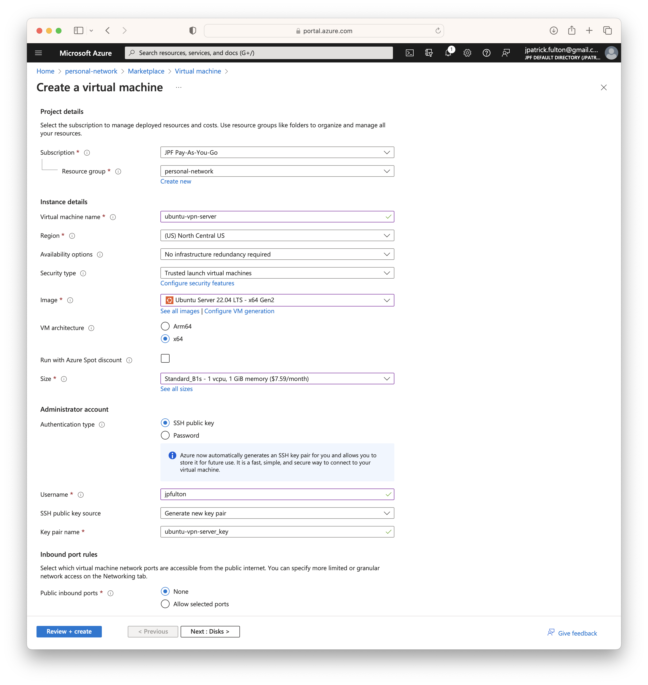
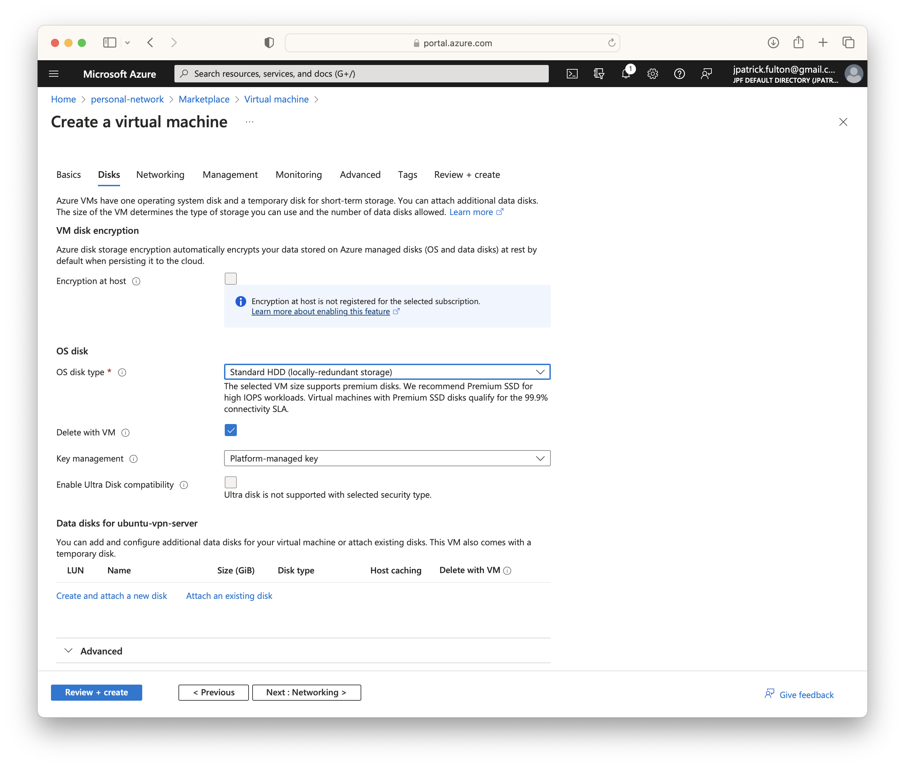
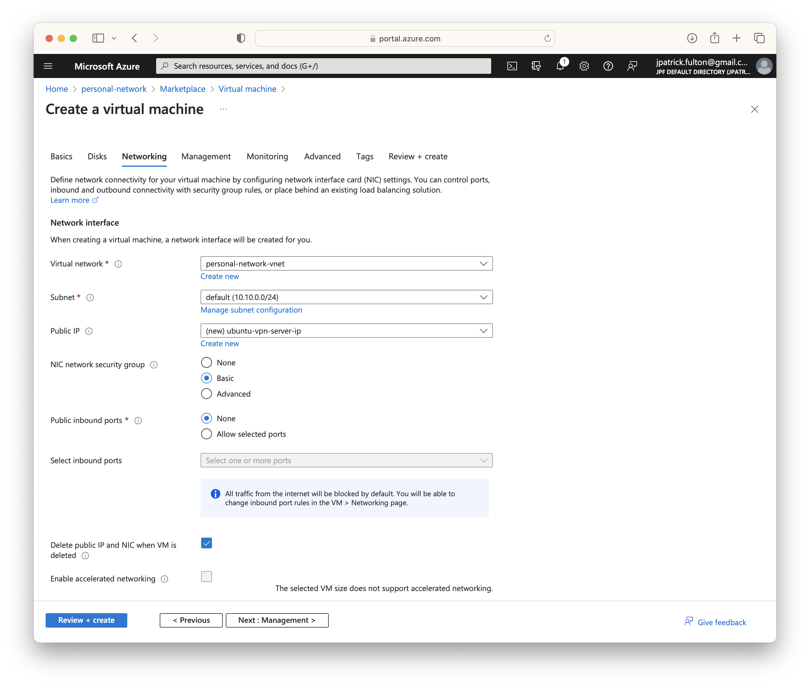
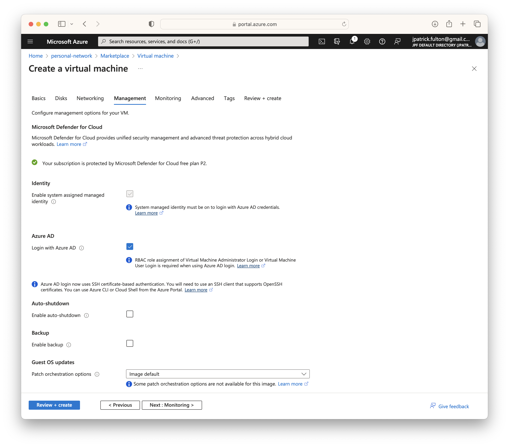
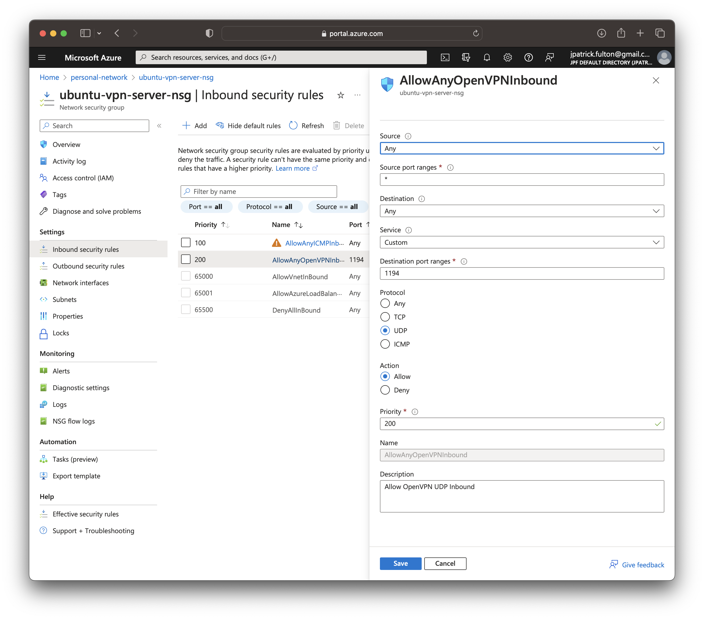
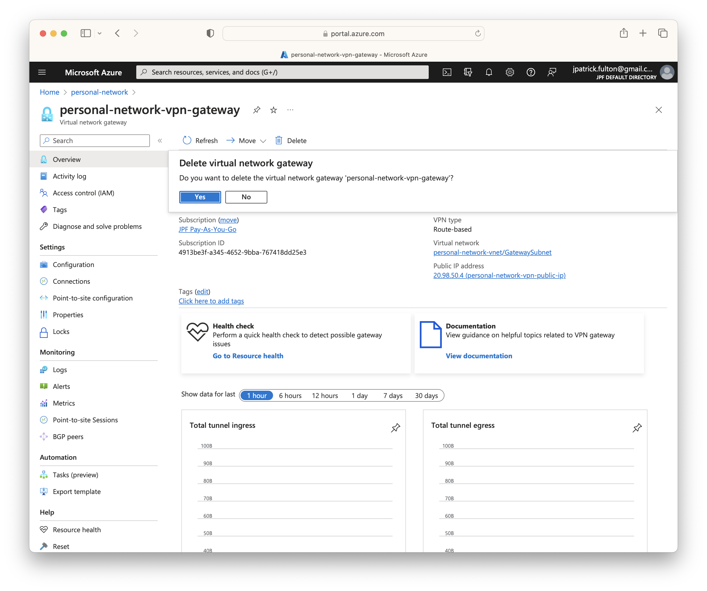
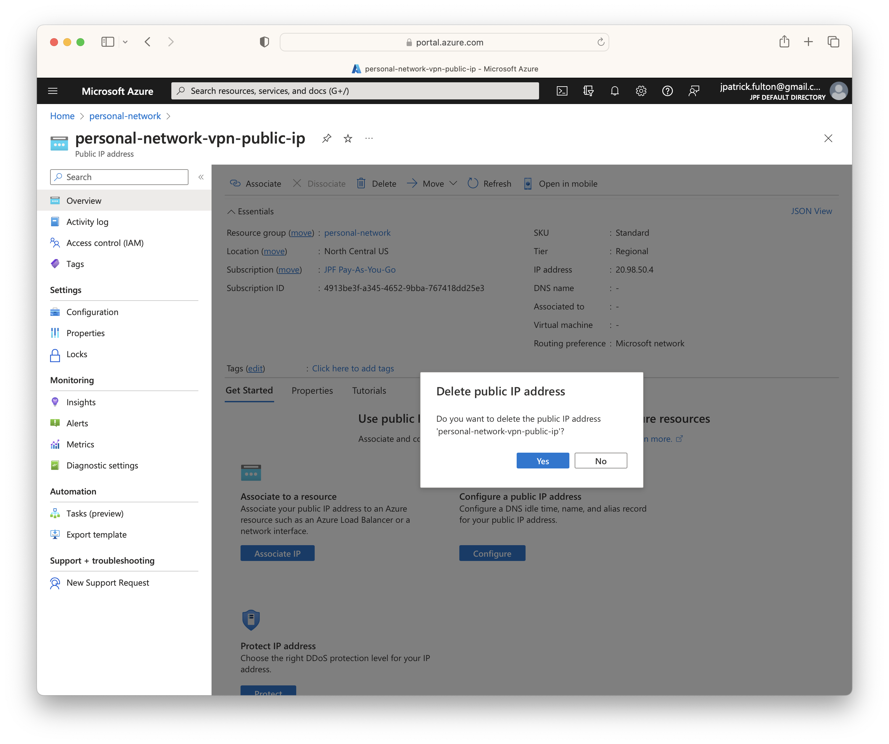
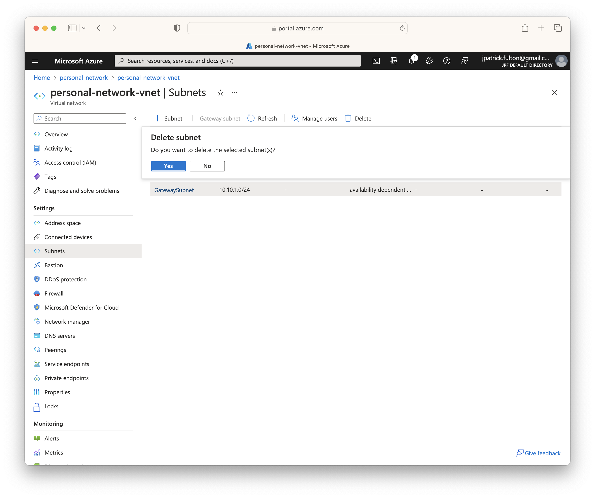

import SeriesLinks from "../2023-07-18-azure-personal-network/seriesLinks.js"

<SeriesLinks />

## Table of Contents

## Create a Virtual Machine

Firstly, we need to create a virtual machine attached to our existing
virtual network and in the resource group to host the OpenVPN tunnel.
From the Azure portal, navigate to the resource group and select
**Create** from the toolbar. Search for **virtual machine** in the Marketplace
and select **Create**.

On the create virtual machine screen, provide a name for the server, select
`Ubuntu Server 22.04 LTS` as the image and select `Standard_B2s` as the
size. Supply an initial username and then select **Next: Disks**.



On the disks step, change the `OS Disk Type` to
`Standard HDD (locally-redundant storage)`. Move on the networking step.



On the networking step, select the virtual network resource and ensure
a new public IP address is created for the NIC. Move on to the management
step.



From the management step, select the `Login with Azure AD` checkbox
and then select **Review + create** to validate and complete the deployment.
The PEM file will be downloaded at the start of the process.



## Configure the Virtual Machine

### Login via SSH using the PEM File

Move the PEM file downloaded during the deployment to your `~/.ssh` folder
and use it to log into the newly created server. The username must match
the one you selected during the virtual machine creation process and the private
IP may be found on the **Networking** tab on the newly created virtual machine
in the portal.

```bash
ssh -i ~/.ssh/ubuntu-vpn-server_key.pem username@10.10.0.5
```

### Update all Packages

Update the packages from the base image using the following commands.

```bash
sudo apt update
sudo apt list --upgradeable
sudo apt upgrade
```

### Set up Local Firewall

Next, we need to set up the local firewall. Neither the on-premise network
nor the virtual network use IPv6. As a result, we should disable IPv6 on
the firewall using the following this
[guide](https://tecadmin.net/setup-ufw-for-firewall-on-ubuntu-and-debian/).

Set up a rule to allow ssh and enable the firewall with the following
commands.

```bash {outputLines: 2-3, 5-6, 8-12}
sudo ufw allow ssh
port 22
Rules updated
sudo ufw enable
Command may disrupt existing ssh connections. Proceed with operation (y|n)? y
Firewall is active and enabled on system startup
sudo ufw status numbered
Status: active

     To                         Action      From
     --                         ------      ----
[ 1] 22/tcp                     ALLOW IN    Anywhere
```

Note that the Azure NSG will prevent access to ssh from the public IP.
This is particularly useful for quickly enabling external access by modifying the
NSG in a pinch.

### Install the OpenVPN and Easy-RSA Packages

Use the package manager to install the `openvpn` and `easy-rsa` packages.
The `easy-rsa` package will be used for generating keys for the tunnel.

```bash
sudo apt install openvpn easy-rsa
```

### Generate Certificates and Keys

[documentation](https://ubuntu.com/server/docs/service-openvpn)

```bash
sudo -s
cd /etc/openvpn/easy-rsa
./easyrsa init-pki
./easyrsa build-ca
./easyrsa gen-req ubuntu-vpn-server nopass
./easyrsa gen-dh
./easyrsa sign-req server ubuntu-vpn-server
cp pki/dh.pem pki/ca.crt pki/issued/ubuntu-vpn-server.crt pki/private/ubuntu-vpn-server.key /etc/openvpn/

./easyrsa gen-req home-client nopass
./easyrsa sign-req client home-client
exit
```

```bash
cd /etc/openvpn
sudo openvpn --genkey secret ta.key
```

Edit `/etc/sysctl.conf`` and uncomment the following line to enable IP forwarding.

`#net.ipv4.ip_forward=1`

Then reload sysctl.

```bash
sudo sysctl -p /etc/sysctl.conf
```

### Configure the Server

#### Create the OpenVPN Server Configuration File

#### Start the OpenVPN Service

```bash
sudo systemctl start openvpn@homeserver
sudo systemctl status openvpn@homeserver
```

```bash
sudo journalctl -u openvpn@homeserver -xe
```

#### Create a DNS Entry for the Server Public IP

#### Configure the Local Server Firewall

```bash {outputLines: 3-8}
sudo ufw allow proto udp from 0.0.0.0/0 to any port 1194
sudo ufw status numbered
Status: active

     To                         Action      From
     --                         ------      ----
[ 1] 22/tcp                     ALLOW IN    Anywhere
[ 2] 1194/udp                   ALLOW IN    Anywhere
```

```bash {outputLines: 3-9}
sudo ufw route allow in on tun0 out on eth0
sudo ufw status numbered
Status: active

     To                         Action      From
     --                         ------      ----
[ 1] 22/tcp                     ALLOW IN    Anywhere
[ 2] 1194/udp                   ALLOW IN    Anywhere
[ 3] Anywhere on eth0           ALLOW FWD   Anywhere on tun0
```

`/etc/ufw/before.rules` Add to top of file

```sh
# NAT table rules
*nat
:POSTROUTING ACCEPT [0:0]

# Forward traffic through eth0 - Change to match your out-interface
-A POSTROUTING -s 10.10.10.0/24 -o eth0 -j MASQUERADE

# don't delete the 'COMMIT' line or these nat table rules won't
# be processed
COMMIT
# End NAT table rules
```

```bash
sudo ufw disable && sudo ufw enable
```

#### Configure the Server Public IP Network Security Group



### Configure the Client

### Create the Client Configuration File

`/etc/openvpn/ca.crt`

`/etc/openvpn/ta.key`

`/etc/openvpn/easy-rsa/pki/issued/home-client.crt`

`/etc/openvpn/easy-rsa/pki/private/home-client.key`

### Copy the Client Configuration File to Local

```bash
scp -i ~/.ssh/ubuntu-vpn-server_key.pem jpfulton@ubuntu-vpn-server.private.jpatrickfulton.com:/home/jpfulton/azure-personal-network.ovpn .
```

## Tear Down the Azure Virtual Network Gateway

### Remove the Virtual Network Gateway Resource



### Remove the Public IP



### Remove the Gateway Subnet from the Virtual Network


