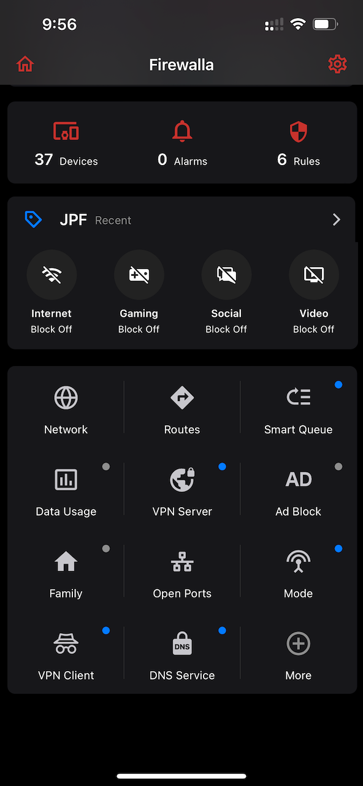
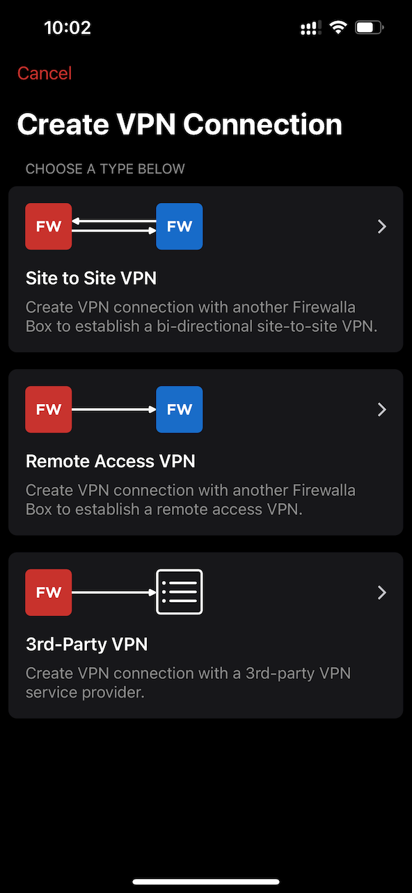
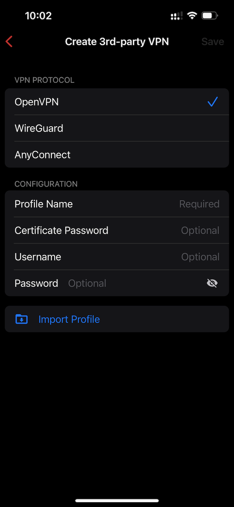
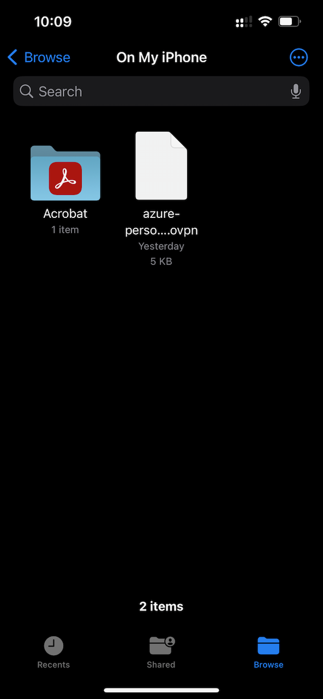
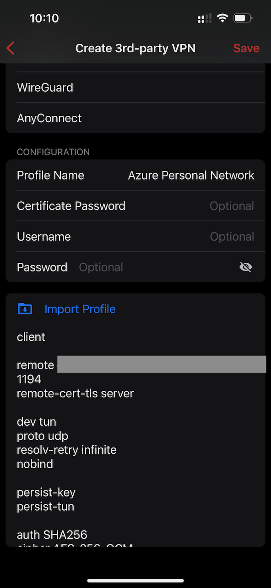
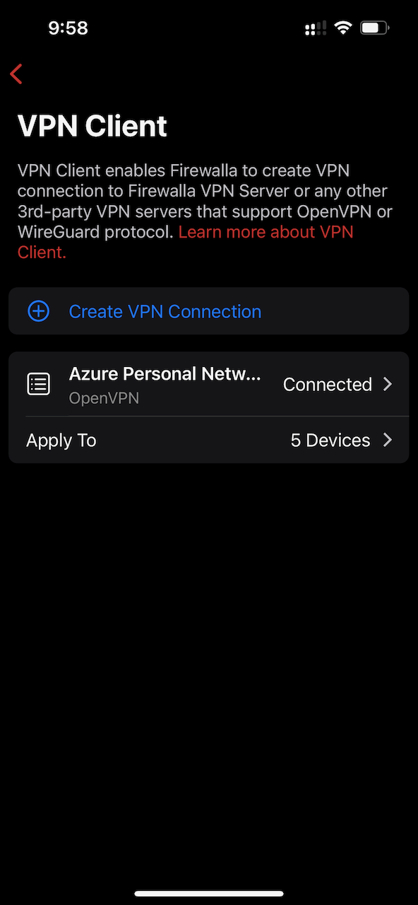
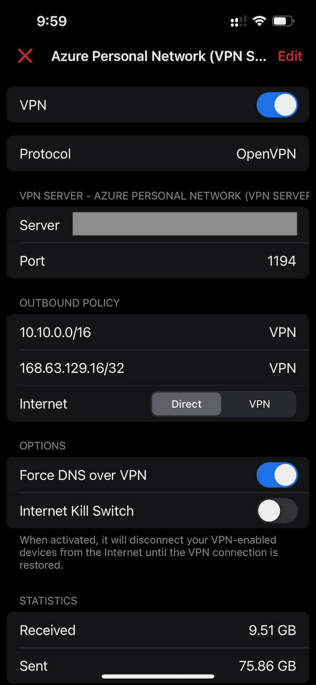

A little over a year ago, I bought a
[Firewalla Gold](https://firewalla.com/products/firewalla-gold) to gate keep my
home network. They are impressive pieces of hardware and are both easy to manage
and powerful. The hardware specification itself is noteworthy:

- 4x Routable Gigabit Ethernet Controllers
- 4GB Memory
- 32GB SSD
- Intel Quad Core CPU

The internal software is based on
[Ubuntu Linux](https://ubuntu.com) and is easy managed via an
[iOS app](https://apps.apple.com/us/app/firewalla/id1180904053?platform=iphone)
or an
[iPad app](https://apps.apple.com/us/app/firewalla/id1180904053?platform=ipad).
It also provides both a web interface and an `ssh` console. The company itself
was founded by
[Cisco](https://www.cisco.com/) engineers. It offers a wide variety of features
that are _immensely_ useful for home and small business users. Among them are
VPN servers and clients that support both
[OpenVPN](https://en.wikipedia.org/wiki/OpenVPN)
and
[WireGuard](https://www.wireguard.com).

In this post, we will configure a Firewalla to use its VPN client feature
to connect a home network to an Azure virtual network using an OpenVPN tunnel
provided by the server that was created in
the <Link to="/blog/2023-07-21-azure-personal-network-replace-vpn/">last post</Link>.

When following this guide, it is an excellent idea to ensure that your
macOS hard drive is encrypted via
[FileVault](https://support.apple.com/guide/mac-help/encrypt-mac-data-with-filevault-mh11785/)
and that your iCloud account is end-to-end encrypted via
[Advanced Data Protection](https://support.apple.com/en-us/HT202303).

import SeriesLinks from "../2023-07-18-azure-personal-network/seriesLinks.js"

<SeriesLinks />

## Table of Contents

## Copy the Client Configuration to a Local Mac

The first step in this process is to _**securely**_ copy the OpenVPN client
configuration from the server where it was created to a local Mac. Use
[scp](https://manpages.ubuntu.com/manpages/jammy/en/man1/scp.1.html) to move
the file. The configuration file includes a private key.

```bash
scp vpn.private.jpatrickfulton.com:~/azure-personal-network.ovpn .
```

## Airdrop the Configuration to an iPhone or iPad

[AirDrop](https://en.wikipedia.org/wiki/AirDrop) provides a
[TLS](https://en.wikipedia.org/wiki/Transport_Layer_Security)
secured mechanism to transfer the file to an iOS or iPadOS device.
The file needs to be temporarily transferred to a device running the
Firewalla app. Use this
[guide](https://support.apple.com/guide/mac-help/airdrop-mac-send-files-devices-mh35868/)
for details on how to establish the transfer.

## Configure the Firewalla VPN Client

From the Firewalla home screen, select **VPN Client**.



Select **Create VPN Client** > **3rd-Party VPN**.



Select **OpenVPN** as the VPN Protocol. Provide a name for the profile under
the Configuration section and then select **Import Profile**.



A file browser will be opened allowing you to navigate to the configuration
file that was AirDropped in an earlier step.



Select **Save** to commit the changes to the device.



## Configure the VPN Connection

From the VPN client screen, select **Apply To** to select groups of devices
to apply the connection to. This should be a limited set. For example,
there is no reason for IoT home devices to have access to the Azure
virtual network. Similarly, gaming devices have no need for access either.



Click on the profile name of the VPN connection to set the final settings.
Make sure the `Internet` setting is set to `Direct` to ensure that only
private network traffic is routed through the VPN. Additionally, set
`Force DNS over VPN` to `true` to enable the private DNS zone to be served
to the selected devices.


