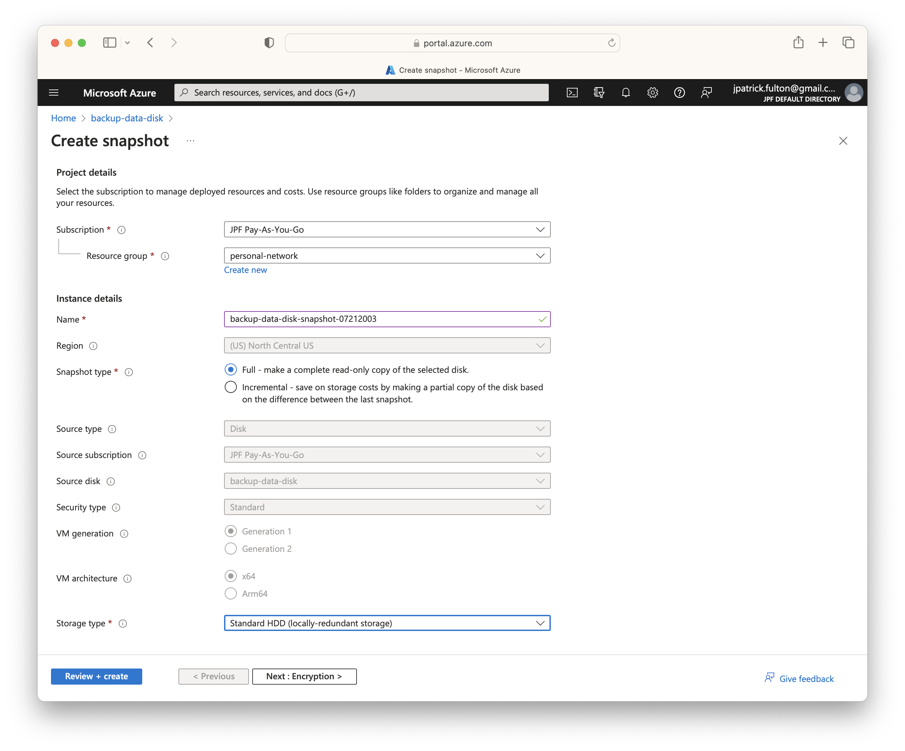
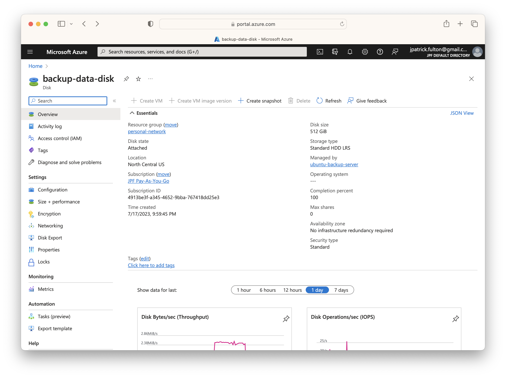
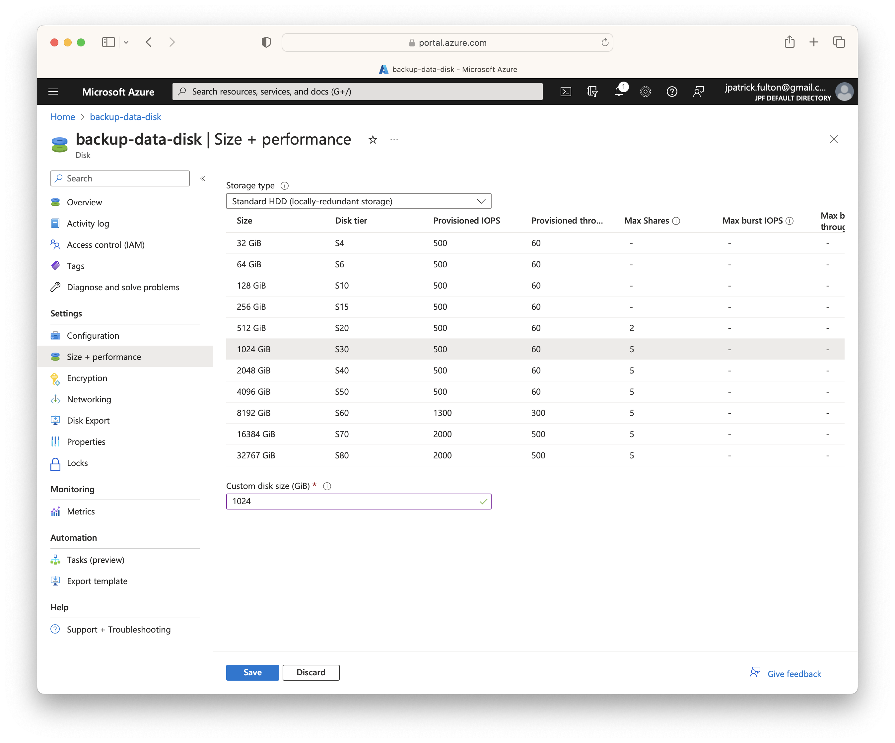
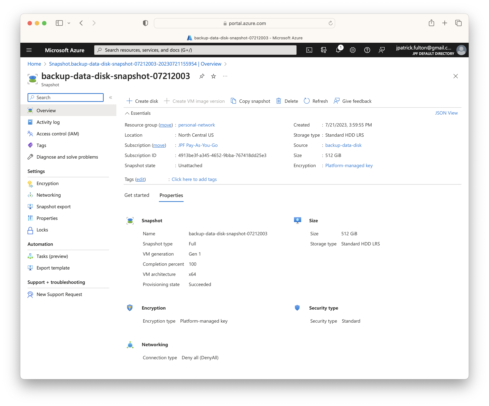

At the start of the project, we began with a backup server data disk
of 512GB. We used a Standard HDD model on locally redundant storage (LRS)
to keep things cost effective as we will not require significant IOPS
or the features of Premium managed disk models. However, it is easy to run
out of space. It is also important to recall that
[managed disks](https://azure.microsoft.com/en-us/products/storage/disks)
can **only**
be _increased_ in size. Size decreases are disallowed to avoid data loss. So
it is important to start small.

In this post, we will resize a managed disk to increase the amount of available
storage space then use Linux operating system utilities to resize its `ext4` partition
to utilize the newly allocated space. In the process, we will create a temporary
disk snapshot to ensure that no data is lost during the operation.

Some of this post is derived from this
[Azure guide](https://learn.microsoft.com/en-us/azure/virtual-machines/linux/expand-disks?tabs=ubuntu)
on resizing Linux disks and is customized for this project.

import SeriesLinks from "../2023-07-18-azure-personal-network/seriesLinks.js"

<SeriesLinks />

## Table of Contents

## Identify the Disk

The first step is to use operating system utilities to identify
the disk we wish to resize. Running the `df` command shows output
that identifies the operating system device identifier, mount point
and current usage statistics.

Here we can see that `/dev/sda1` is mounted to the `/backup` folder.

```bash {outputLines: 2-10}
df -Th
Filesystem     Type   Size  Used Avail Use% Mounted on
/dev/root      ext4    29G  6.9G   23G  24% /
tmpfs          tmpfs  1.9G     0  1.9G   0% /dev/shm
tmpfs          tmpfs  773M  2.6M  771M   1% /run
tmpfs          tmpfs  5.0M     0  5.0M   0% /run/lock
/dev/sda1      ext4   503G  251G  227G  53% /backup
/dev/sdb15     vfat   105M  6.1M   99M   6% /boot/efi
/dev/sdc1      ext4   7.8G   28K  7.4G   1% /mnt
tmpfs          tmpfs  387M  4.0K  387M   1% /run/user/1000
```

Azure uses logical unit numbers (LUN) when attaching data disks.
Listing the `/dev/disk/azure/scsi1/` devices will show the LUN for
each disk.

```bash {outputLines: 2-6}
sudo ls -alF /dev/disk/azure/scsi1/
total 0
drwxr-xr-x 2 root root  80 Jul 19 15:58 ./
drwxr-xr-x 3 root root 180 Jul 19 15:58 ../
lrwxrwxrwx 1 root root  12 Jul 19 15:58 lun0 -> ../../../sda
lrwxrwxrwx 1 root root  13 Jul 19 15:58 lun0-part1 -> ../../../sda1
```

The logical unit numbers identified with the last command line up with
the LUNs listed on the **Disks** tab when viewing the virtual machine
in the Azure portal. From the disks management screen, we can navigate
to the disk resource by clicking on its name.

## Create a Snapshot

To ensure safety and avoid any potential data loss during this operation. We
will take a snapshot of the managed disk prior to taking any action. From the
disk overview in the portal, select **Create snapshot** from the toolbar to
start the process. Provide a name for the snapshot and then select **Review + create**.
This snapshot can be removed following the operation.



## Expand the Disk without Downtime

In most cases, managed disk expansion can be performed without
shutting down the virtual machine. There are several caveats, however.

> You can expand your managed disks without deallocating your VM.
> The host cache setting of your disk doesn't change whether or not you can
> expand a data disk without deallocating your VM.

Online disk resizing is only supported for data disks. Check for other criteria
in the [documentation](https://learn.microsoft.com/en-us/azure/virtual-machines/linux/expand-disks?tabs=ubuntu#expand-without-downtime).

Navigate to the disk in the portal.



Select **Size + performance** and select a new size from the table. Click **Save**
to perform the operation.



## Detect the Disk Size Change

Within the guest operating system, run `fdisk` to observe the current
configuration.

```bash {outputLines: 2-11}
sudo fdisk -l /dev/sda
Disk /dev/sda: 512 GiB, 549755813888 bytes, 1073741824 sectors
Disk model: Virtual Disk
Units: sectors of 1 * 512 = 512 bytes
Sector size (logical/physical): 512 bytes / 4096 bytes
I/O size (minimum/optimal): 4096 bytes / 4096 bytes
Disklabel type: dos
Disk identifier: 0x98e21008

Device     Boot Start        End    Sectors  Size Id Type
/dev/sda1        2048 1073741823 1073739776  512G 83 Linux
```

Run the following command to force an operating system re-scan
of the disks. This is normally only performed upon boot.

```bash
echo 1 | sudo tee /sys/class/block/sda/device/rescan
```

Now that a scan has been completed. Run `fdisk` once more to observe
the changed size. Note that the partition `sda1` is still its original
size even though total disk capacity has increased.

```bash {outputLines: 2-11}
sudo fdisk -l /dev/sda
Disk /dev/sda: 1 TiB, 1099511627776 bytes, 2147483648 sectors
Disk model: Virtual Disk
Units: sectors of 1 * 512 = 512 bytes
Sector size (logical/physical): 512 bytes / 4096 bytes
I/O size (minimum/optimal): 4096 bytes / 4096 bytes
Disklabel type: dos
Disk identifier: 0x98e21008

Device     Boot Start        End    Sectors  Size Id Type
/dev/sda1        2048 1073741823 1073739776  512G 83 Linux
```

## Resize the Partition

Now that we have identified the disk device and increased the capacity
of the managed disk. The partition needs to be resized to utilize the
new space.

### Shutdown Samba

To prevent error to Samba clients, we will shutdown the service while we
work on the disk using the following command.

```bash
sudo systemctl stop smbd
```

### Unmount the Partition

Before working on the partition, we need to unmount the disk from the
filesystem using the following command.

```bash
sudo umount /dev/sda1
```

### Use fdisk to Update the Partition Table

Next we will use the `fdisk` utility to alter the partition table. Run it
with the following command. The partition table will only be updated at the
end of the process with user consent.

First, enter `d` to delete the existing partition. Then, enter `n` to
create a new partition. Use the `primary` partition type. Elect the
defaults for first and last sector. They will create the largest possible
partition. Select `n` to retain the partition signature.

Finally, enter the `p` command to review the partition table and
enter `w` to write it to disk following review.

```bash {outputLines: 2-43}
sudo fdisk /dev/sda
Welcome to fdisk (util-linux 2.37.2).
Changes will remain in memory only, until you decide to write them.
Be careful before using the write command.


Command (m for help): d
Selected partition 1
Partition 1 has been deleted.

Command (m for help): n
Partition type
   p   primary (0 primary, 0 extended, 4 free)
   e   extended (container for logical partitions)
Select (default p):

Using default response p.
Partition number (1-4, default 1):
First sector (2048-2147483647, default 2048):
Last sector, +/-sectors or +/-size{K,M,G,T,P} (2048-2147483647, default 2147483647):

Created a new partition 1 of type 'Linux' and of size 1024 GiB.
Partition #1 contains a ext4 signature.

Do you want to remove the signature? [Y]es/[N]o: n

Command (m for help): p

Disk /dev/sda: 1 TiB, 1099511627776 bytes, 2147483648 sectors
Disk model: Virtual Disk
Units: sectors of 1 * 512 = 512 bytes
Sector size (logical/physical): 512 bytes / 4096 bytes
I/O size (minimum/optimal): 4096 bytes / 4096 bytes
Disklabel type: dos
Disk identifier: 0x98e21008

Device     Boot Start        End    Sectors  Size Id Type
/dev/sda1        2048 2147483647 2147481600 1024G 83 Linux

Command (m for help): w
The partition table has been altered.
Calling ioctl() to re-read partition table.
Syncing disks.
```

Before resizing the filesystem, we need to run a `e2fsck` on the partition.
Following the check operation, we can use `resize2fs` to expand the file system
to fill the empty space on the partition.

```bash {outputLines: 2-8, 10-12}
sudo e2fsck -f /dev/sda1
e2fsck 1.46.5 (30-Dec-2021)
Pass 1: Checking inodes, blocks, and sizes
Pass 2: Checking directory structure
Pass 3: Checking directory connectivity
Pass 4: Checking reference counts
Pass 5: Checking group summary information
/dev/sda1: 10184/33554432 files (80.3% non-contiguous), 68024720/134217472 blocks
sudo resize2fs /dev/sda1
resize2fs 1.46.5 (30-Dec-2021)
Resizing the filesystem on /dev/sda1 to 268435200 (4k) blocks.
The filesystem on /dev/sda1 is now 268435200 (4k) blocks long.
```

### Remount the Partition

After resizing the partition, we can mount it back to the `/backup`
mount point. Following the mount, run a `ls` command to validate the
contents of the filesystem. Finally, a `df` command run will show
the updated capacity of the filesystem.

```bash {outputLines: 3-8, 10-18}
sudo mount /dev/sda1 /backup
ls -la /backup/
total 32
drwxr-xr-x  5 root    root      4096 Jul 18 04:31 .
drwxr-xr-x 22 root    root      4096 Jul 19 15:58 ..
drwxr-xr-x  2 smbuser smbgroup  4096 Jul 21 18:54 applebackups
drwxr-xr-x  3 smbuser smbgroup  4096 Jul 18 04:45 linuxbackups
drwx------  2 root    root     16384 Jul 18 03:38 lost+found
df -Th
Filesystem     Type   Size  Used Avail Use% Mounted on
/dev/root      ext4    29G  6.9G   23G  24% /
tmpfs          tmpfs  1.9G     0  1.9G   0% /dev/shm
tmpfs          tmpfs  773M  2.6M  771M   1% /run
tmpfs          tmpfs  5.0M     0  5.0M   0% /run/lock
/dev/sdb15     vfat   105M  6.1M   99M   6% /boot/efi
/dev/sdc1      ext4   7.8G   28K  7.4G   1% /mnt
tmpfs          tmpfs  387M  4.0K  387M   1% /run/user/1000
/dev/sda1      ext4  1007G  251G  706G  27% /backup
```

### Start Samba

The Samba service can be restarted to check for any errors.

```bash
sudo systemctl start smbd
sudo systemctl status smbd
```

## Reboot System

With the disk operation completed, the system can be rebooted to ensure
the boot configuration is up-to-date.

```bash
sudo shutdown -r
```

Once the system has come back up, log in. Check the mounts and check the logs
for any errors.

## Remove the Disk Snapshot

If everything is working as expected, the snapshot that was taken early can be
deleted by selecting **Delete** on the toolbar when viewing it in the Azure portal.


