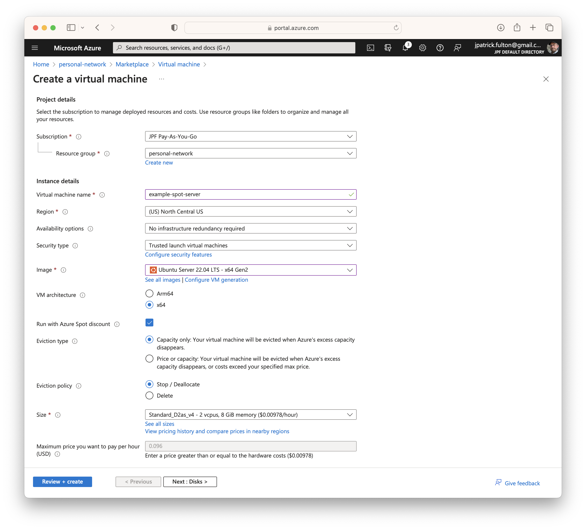
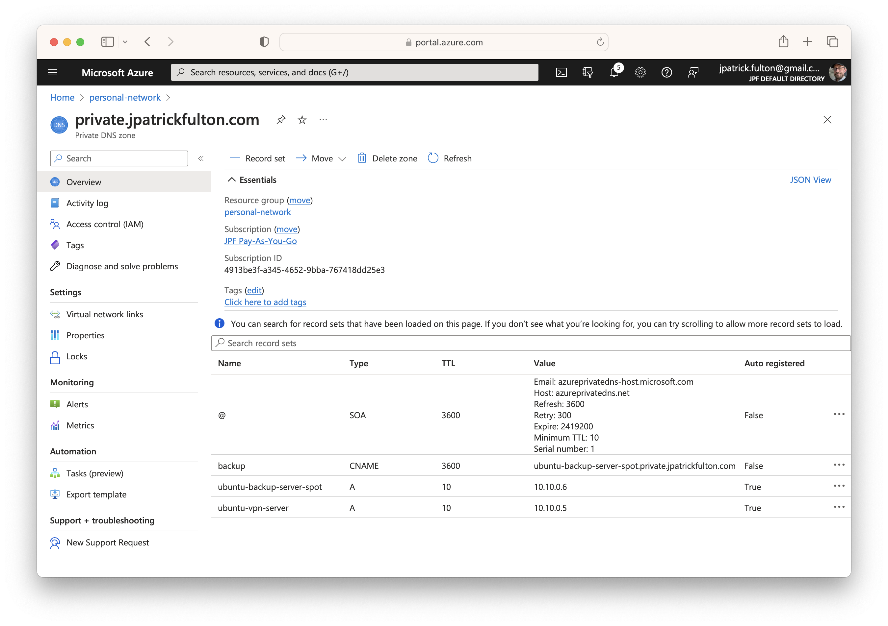
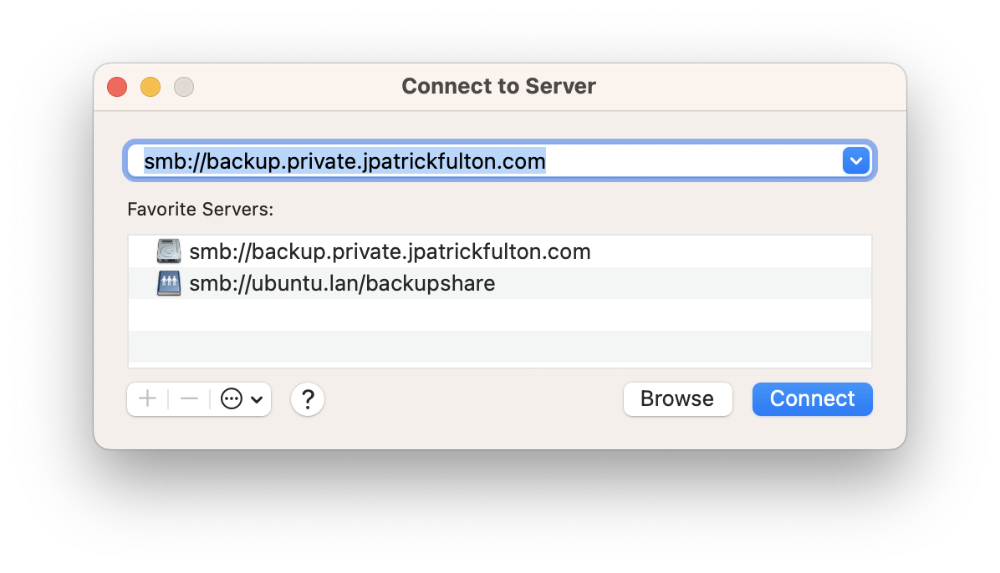
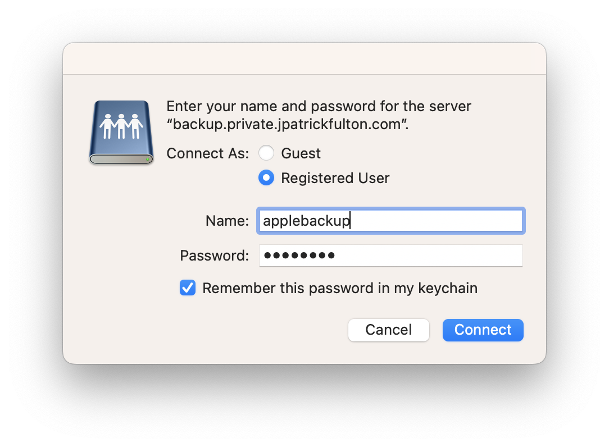
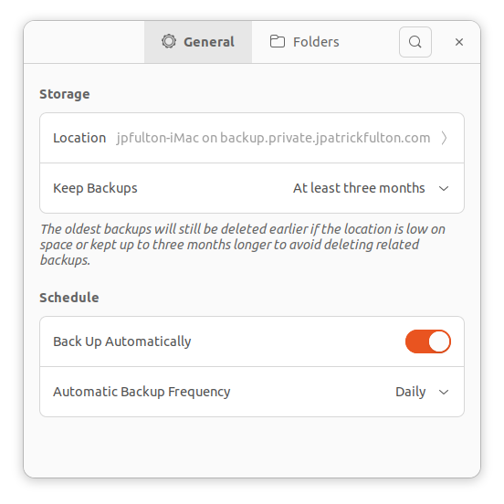
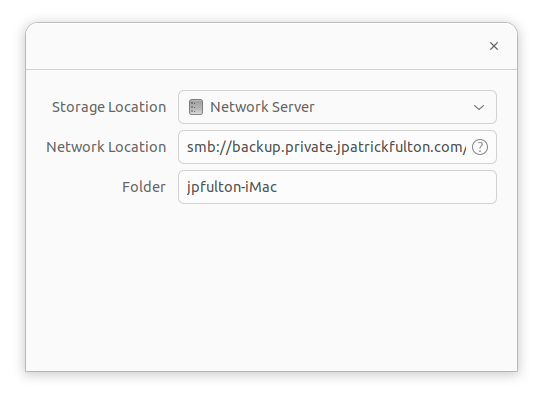
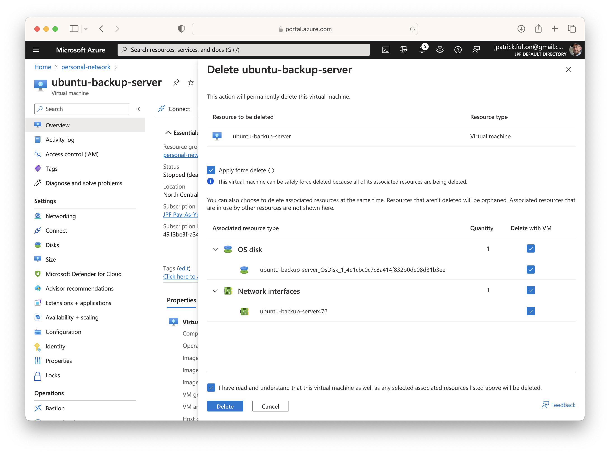

import SeriesLinks from "../2023-07-18-azure-personal-network/seriesLinks.js"

<SeriesLinks />

## Table of Contents

## Create then Initialize the Spot VM Instance

### Create the Spot Virtual Machine

Spot VMs must be configured to the **Run with Azure Spot discount** option
at the point of creation as shown in the screenshot below. Once this option
is selected, the **Eviction type** and **Eviction options** sections become
available. All other steps associated with the creation of a virtual machine
are the same as the ones described
in <Link to="/blog/2023-07-20-azure-personal-network-vm-smbd/">the previous post</Link>
on the original Samba server.

For this workload, we need an eviction policy that _stops and deallocates_ the
virtual machine when the Azure region needs the underlying resources. Other
workload types may elect to _delete_ the virtual machine and its underlying resources
during an eviction.
However, we wish to restart the virtual machine when capacity becomes available
once more. In a later post, we will develop an external orchestration mechanism
that tests for the return of capacity and restarts the virtual machine following
an eviction.



### Perform Base Image Initialization

Once the virtual machine has been allocated, we need to log in and perform
some initial configuration steps.

- Update all base packages
- Perform initial local firewall configuration
- Install MOTD modifications
- Prepare for graceful shutdown in the event of an eviction
  (manual steps covered below)

As these steps are fairly repetitive, I have taken to scripting them.

A complete script for performing these steps is available
[here](https://github.com/jpfulton/example-linux-configs/blob/main/home/jpfulton/init-azure-ubutu-vm.sh).

### Spot Eviction Readiness

As a spot virtual machine running on excess capacity, the virtual machine needs
to be ready for eviction by Azure to create capacity for premium workloads with
as little as 30 seconds notice. As a result, we need to consistently query the
[Scheduled Event API](https://learn.microsoft.com/en-us/azure/virtual-machines/linux/scheduled-events)
an initiate a graceful shutdown in the event an eviction has been initiated by
Azure.

The Scheduled Event API is hosted on a non-routable address within the virtual network:
`169.254.169.254`. We may query this endpoint as often once per second per the documentation.
However, querying and then processing the results require CPU and memory. In our
workload, we will query every 10 seconds in the final configuration.

#### The Eviction Query Script

The core logic of the eviction event polling and graceful shutdown mechanism
is a `bash` script that utilizes `curl` to query the endpoint. The JSON results
of the query are piped into `grep` to look for instances of the `Preempt` event.
If a preempt event is discovered, a notice is passed to system users and a
operating system shutdown is started.

The script requires root permissions to run and should be stored in
`/usr/local/sbin` as a result.

```sh
#!/usr/bin/env bash

ENDPOINT_IP="169.254.169.254";
API_VERSION="2020-07-01";

HEADER="Metadata:true";
ENDPOINT_URL="http://${ENDPOINT_IP}/metadata/scheduledevents?api-version=${API_VERSION}";

if [ "$(curl -s -H ${HEADER} ${ENDPOINT_URL} | grep -c Preempt)" -ge 1 ]
    then
        echo "Azure preempt event found... Shutting down.";
        wall "Azure preempt event found... Shutting down cleanly prior to eviction.";
        sleep 5;
        shutdown now "Shutting down. Virtual machine is being evicted.";
    else
        echo "No Azure preempt event found.";
fi
```

A current version of this complete script can be found
[here](https://github.com/jpfulton/example-linux-configs/blob/main/usr/local/sbin/query-for-preempt-event.sh).

#### The Eviction Query Crontab Configuration

With the logic of the script in place, the next step is schedule its execution.
This is accomplished by placing a `crontab` snippet into the `/etc/cron.d/` directory.

Cron does not allow for scheduling below the minute level. In order to achieve execution
of the script every 10 seconds, a little trickery using the `sleep` command can be
performed. All six jobs are kicked off simultaneously with varying levels of sleep
in front of script execution.

To support logging to `syslogd`, both the `stdout` and `stderr` outputs of the script
are directed to the `logger` command with a tag of `preempt-script`. Outputs from
the script will be available in `/var/log/syslog`.

```sh
# /etc/cron.d/preempt-query: crontab entries for the vm preempt event query script

SHELL=/bin/sh
PATH=/usr/sbin:/usr/bin:/sbin:/bin

* * * * * root ( /usr/local/sbin/query-for-preempt-event.sh ) 2>&1 | logger -t preempt-query
* * * * * root ( sleep 10 ; /usr/local/sbin/query-for-preempt-event.sh ) 2>&1 | logger -t preempt-query
* * * * * root ( sleep 20 ; /usr/local/sbin/query-for-preempt-event.sh ) 2>&1 | logger -t preempt-query
* * * * * root ( sleep 30 ; /usr/local/sbin/query-for-preempt-event.sh ) 2>&1 | logger -t preempt-query
* * * * * root ( sleep 40 ; /usr/local/sbin/query-for-preempt-event.sh ) 2>&1 | logger -t preempt-query
* * * * * root ( sleep 50 ; /usr/local/sbin/query-for-preempt-event.sh ) 2>&1 | logger -t preempt-query

```

A current version of this complete file can be found
[here](https://github.com/jpfulton/example-linux-configs/blob/main/etc/cron.d/preempt-query).

## Perform Initial Samba Configuration

Following the same steps used
in <Link to="/blog/2023-07-20-azure-personal-network-vm-smbd/">the previous post</Link>,
Samba needs to be installed with local users and Samba users:

- Install Samba
- Create Local Samba User and Group
- Create Samba Passwords for Use in Shares
- Configure `/etc/samba/smb.conf`

To save a little time, I used `scp` to move the `smb.conf` file from the original
server.

## Shutdown the Existing Backup Server

With intention of detaching and moving the backup data disk to the new spot
instance, we need to use the portal to stop the original server. Navigate
to the old server in the portal and select **Stop** from the main toolbar.

## Snapshot Backup Data Disk

For safety, prior to performing any operations on the data disk. Create a snapshot
by navigating to the disk in the portal and selecting **Create snapshot**. Once
the disk operations have finished and we have proven everything is working, this
snapshot can be removed.

## Detach the Data Disk from the Original Backup Server

Within the portal while navigated to the original server, select
**Settings** > **Disks** and scroll to the **Data disks** section. Scroll
to the far right of the screen and select the **Detach** button to detach
the disk from the virtual machine. Select **Save** to perform the operation.

## Attach the Data Disk to the Spot VM

The next steps can be performed while the new spot server is running.

Navigate to the new spot virtual machine in the portal and select
**Settings** > **Disks**. Scroll to the **Data disks** section and select
**Attach existing disks**. Select the existing data disk from the dropdown
menu and the click **Save** from the toolbar. The disk will be presented
to the virtual machine live.

Log into the server via `ssh`. Run a `ls` command to find the new
disk device in the operating system. Recall that it has a single
primary partition formatted with `ext4` from when created it.

```bash {8-9}{numberLines: true}{outputLines: 2-9}
ls -la /dev/sd*
brw-rw---- 1 root disk 8,  0 Jul 24 18:27 /dev/sda
brw-rw---- 1 root disk 8,  1 Jul 24 18:27 /dev/sda1
brw-rw---- 1 root disk 8, 14 Jul 24 18:27 /dev/sda14
brw-rw---- 1 root disk 8, 15 Jul 24 18:27 /dev/sda15
brw-rw---- 1 root disk 8, 16 Jul 24 18:27 /dev/sdb
brw-rw---- 1 root disk 8, 17 Jul 24 18:27 /dev/sdb1
brw-rw---- 1 root disk 8, 32 Jul 24 19:18 /dev/sdc
brw-rw---- 1 root disk 8, 33 Jul 24 19:18 /dev/sdc1
```

In this case, the device is `/dev/sdc` and the partition is `/dev/sdc1`.
Run `lsblk` to verify the size of the partition and that it does not
yet have a mount point.

```bash {13-14}{numberLines: true}{outputLines: 2-14}
lsblk
NAME    MAJ:MIN RM   SIZE RO TYPE MOUNTPOINTS
loop0     7:0    0  63.4M  1 loop /snap/core20/1974
loop1     7:1    0  53.3M  1 loop /snap/snapd/19457
loop2     7:2    0  63.4M  1 loop /snap/core20/1950
loop3     7:3    0 111.9M  1 loop /snap/lxd/24322
sda       8:0    0    30G  0 disk
├─sda1    8:1    0  29.9G  0 part /
├─sda14   8:14   0     4M  0 part
└─sda15   8:15   0   106M  0 part /boot/efi
sdb       8:16   0    16G  0 disk
└─sdb1    8:17   0    16G  0 part /mnt
sdc       8:32   0     1T  0 disk
└─sdc1    8:33   0  1024G  0 part
```

Create a backup directory on the file system as a mountpoint
and mount the partition.

```bash
sudo mkdir /backup
sudo mount -t ext4 -o rw /dev/sdc1 /backup
```

List the files, permissions and user/group ownership on the newly
mounted device. Note that the group ownership is incorrect on the
newly mounted filesystem. This is due to group IDs being different
between the new and old system.

```bash {5-6}{numberLines: true}{outputLines: 2-7}
ls -la /backup/
total 32
drwxr-xr-x  5 root    root        4096 Jul 18 04:31 .
drwxr-xr-x 22 root    root        4096 Jul 24 19:22 ..
drwxr-xr-x  3 smbuser aad_admins  4096 Jul 24 14:52 applebackups
drwxr-xr-x  3 smbuser aad_admins  4096 Jul 18 04:45 linuxbackups
drwx------  2 root    root       16384 Jul 18 03:38 lost+found
```

To correct this problem, change group ownership recursively with the
following commands:

```bash
sudo chown -R smbuser:smbgroup /backup/applebackups
sudo chown -R smbuser:smbgroup /backup/linuxbackups
```

Now that things are working as expected with the newly mounted filesystem,
we can modify `/etc/fstab` to ensure the filesystem will mount on boot.

```sh {5}{numberLines: true}
# CLOUD_IMG: This file was created/modified by the Cloud Image build process
UUID=1c12acfb-8f0c-440f-b6b7-6c22c1f36e1e       /        ext4   discard,errors=remount-ro       0 1
UUID=B6C3-B75F  /boot/efi       vfat    umask=0077      0 1
/dev/disk/cloud/azure_resource-part1    /mnt    auto    defaults,nofail,x-systemd.requires=cloud-init.service,_netdev,comment=cloudconfig       0       2
/dev/sdc1 /backup ext4 rw 0 0
```

Reboot with `sudo shutdown -r` to prove everything is working and then
validate the filesystem after logging in following the reboot.

## Update the Local Firewall

Next update the firewall rules to allow Samba traffic with the following
commands:

```bash
sudo ufw allow samba
sudo ufw status numbered
```

## Start the Samba Service

At this point, we are ready to start the Samba service and connect
with a client to prove everything is working as expected.

```bash
sudo systemctl start smbd
sudo systemctl status smbd
```

## Create a CNAME Record on the Private DNS Zone

My host names are getting long and this exercise of changing out
a key server reminded me that there are more convenient methods to
setting up name resolution now that private DNS zone has been established
on the network. While servers auto-register themselves with the DNS zone,
it is also possible to create manual entries. As a result, I created
a CNAME record to point to the new server's A record in the private zone.
In the future, I will configure all backup clients to use
`backup.private.jpatrickfulton.com` rather than the FQDN of the backup
server, giving me the freedom to switch out the implementation server
without revisiting client configurations again.



## Configure the Backup Clients

Now that the server has been exchanged for a spot instance and a new
internal DNS name is in place, the local network backup clients require
reconfiguration.

### Reconfigure macOS Clients

From a Finder window, select **Go** > **Connect to server** to open
a dialog to allow macOS to select the new server and set up authentication.



Enter credentials and mount the `applebackups` share.



Please note that if existing backups were encrypted with a password, they
may need to be recreated as the password is matched to the server hostname.

### Reconfigure Linux Clients

The Linux clients are much more forgiving. From Ubuntu Desktop,
select **Activities** and search for **Backups**.


Select **Preferences** from the menu.



Click on the **Location** field and then update the `smb` URL.



## Clean up by Deleting the Original Server and Snapshot

- Deleting the old backup server takes the OS disk and NIC with it
- The NSG for the NIC needs manual cleanup
- Delete the data disk snapshot


